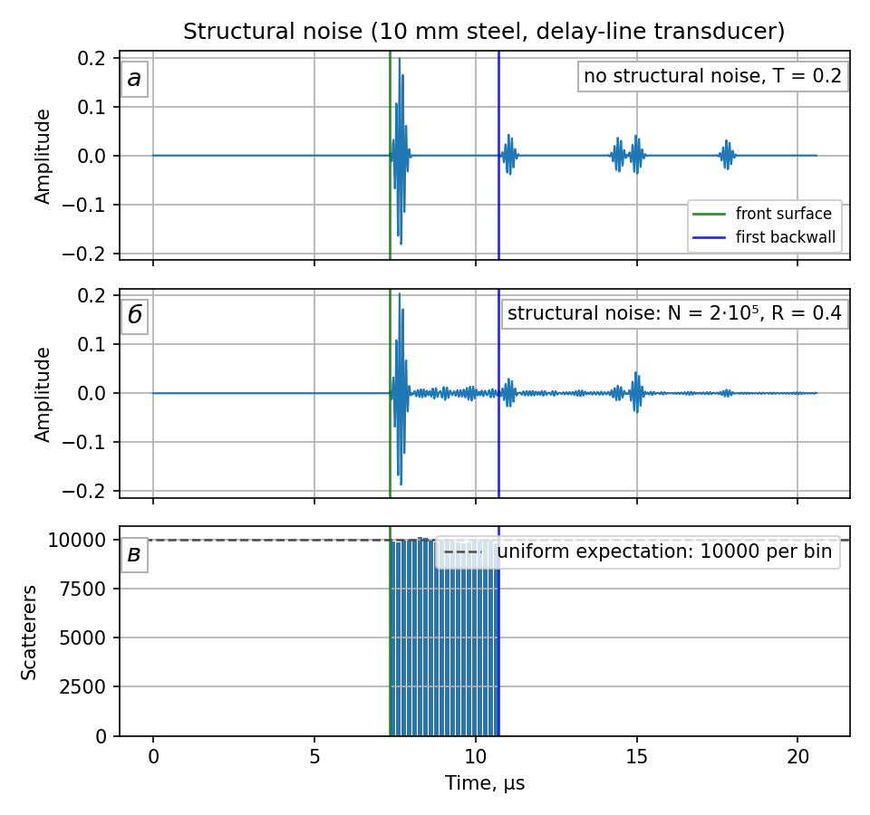
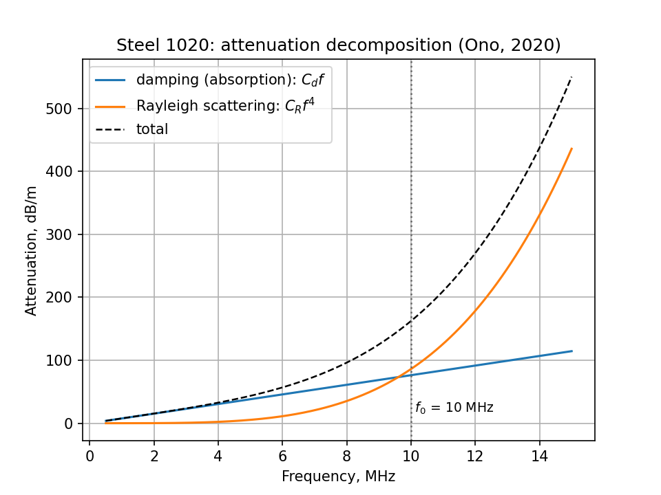
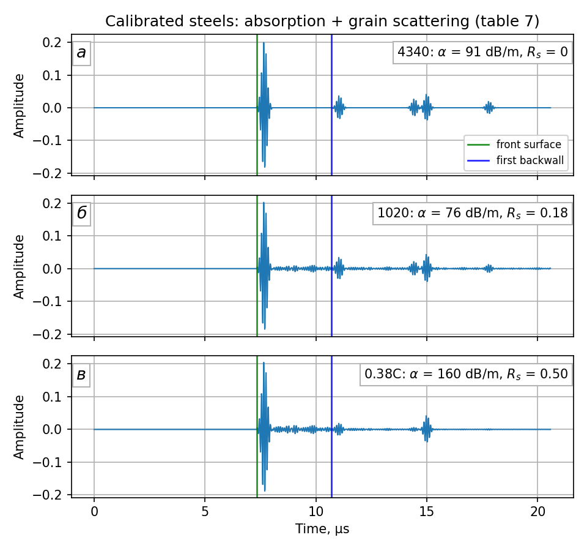
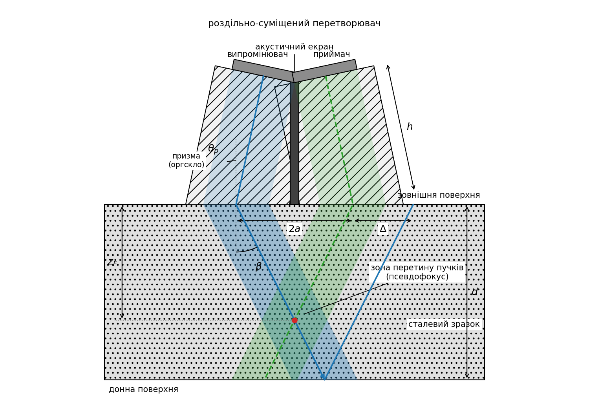
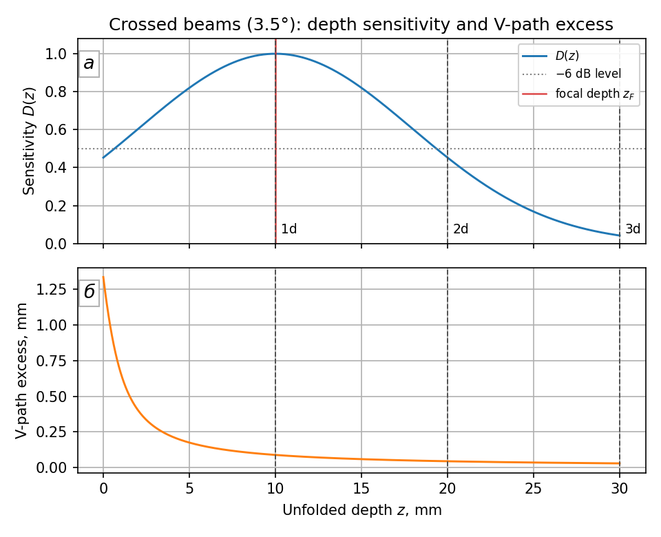
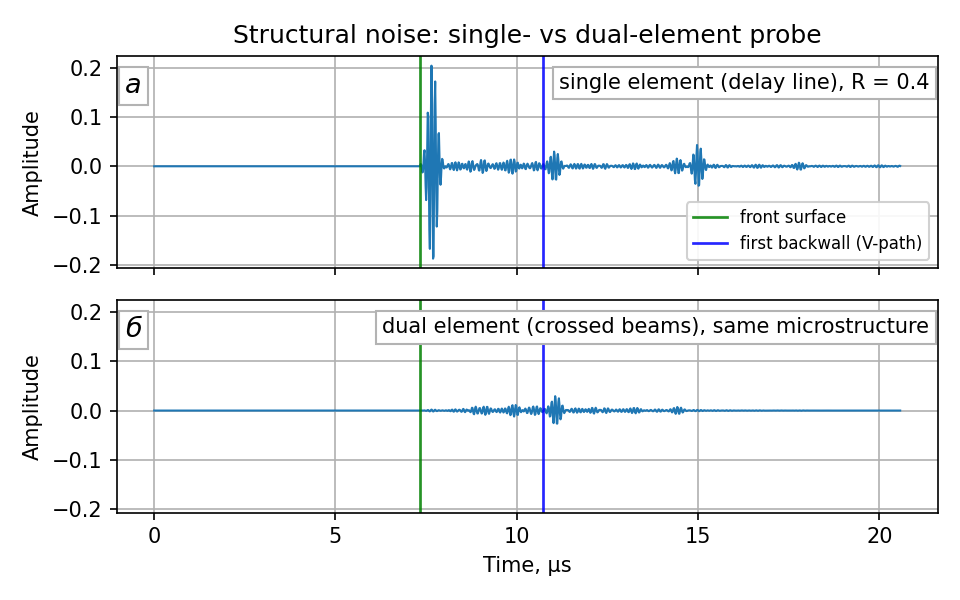
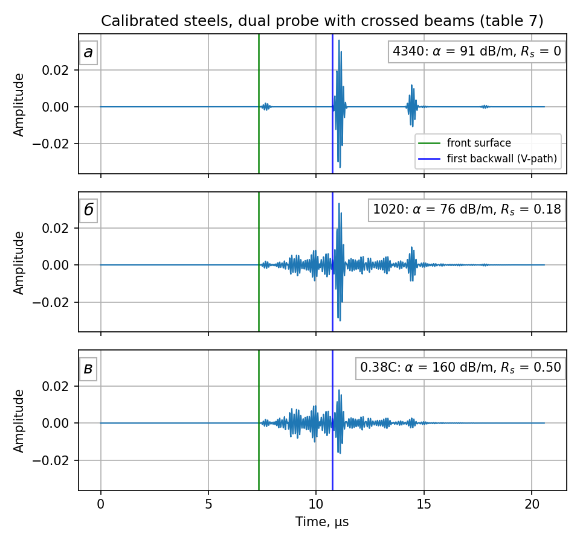
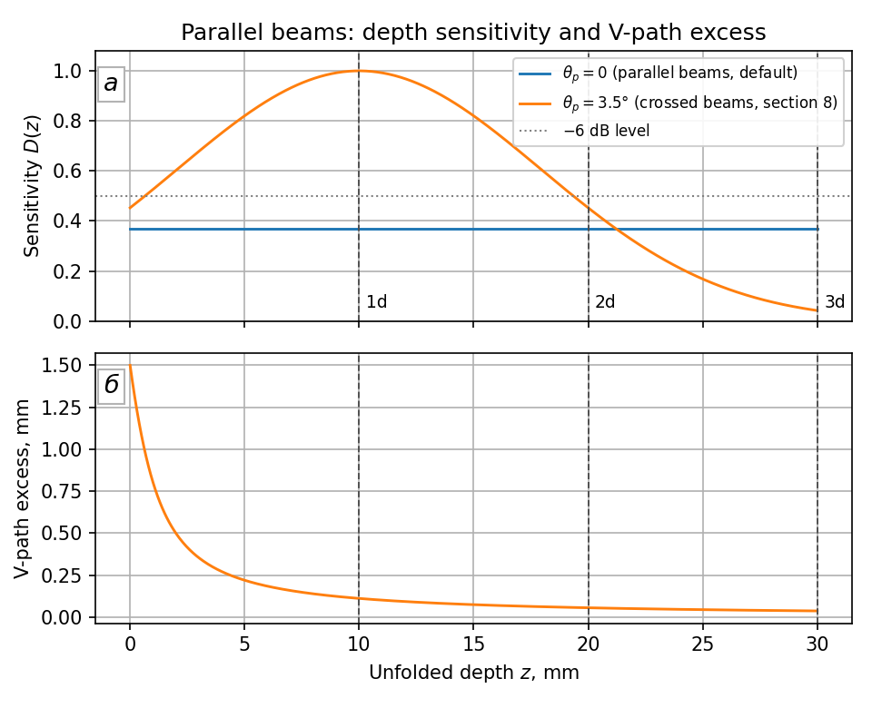
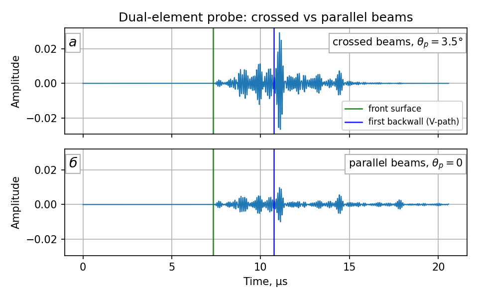
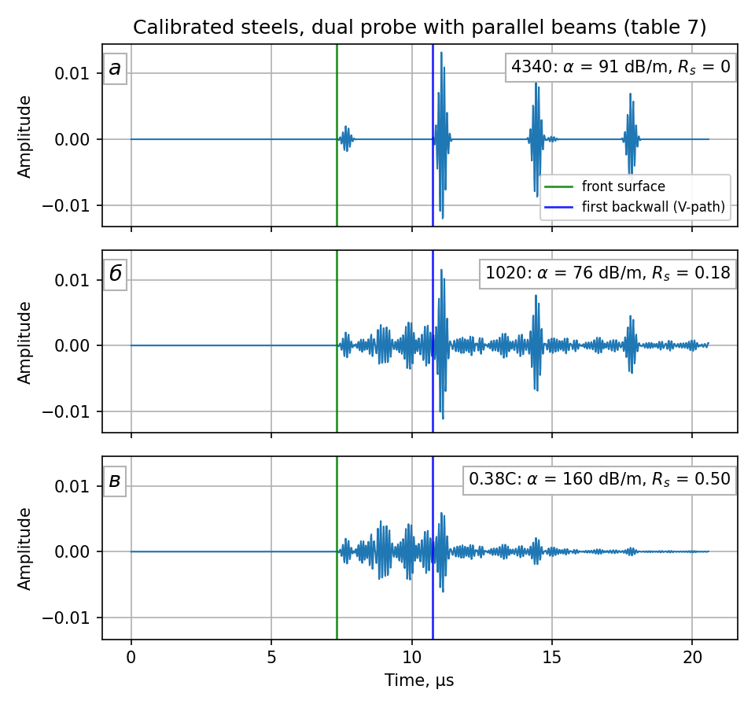

# backscatter-synthesize

Чисельний синтез зворотно розсіяного сигналу двоелементного (роздільно-суміщеного) ультразвукового п'єзоелектричного перетворювача для задач неруйнівного контролю (дефектоскопія та товщинометрія). Модель будується поетапно; цей документ оновлюється в міру додавання нових ланок сигнального тракту.

## Зміст

1. [Зондувальний імпульс](#1-зондувальний-імпульс)
2. [Модель зразка: періодичні донні відбиття](#2-модель-зразка-періодичні-донні-відбиття)
3. [Перетворювач із призмою (лінією затримки)](#3-перетворювач-із-призмою-лінією-затримки)
4. [Акустичний контакт між призмою та зразком](#4-акустичний-контакт-між-призмою-та-зразком)
5. [Дефект у зразку](#5-дефект-у-зразку)
6. [Структурний шум](#6-структурний-шум)
7. [Розкладання загасання: поглинання та розсіяння](#7-розкладання-загасання-поглинання-та-розсіяння)
8. [Роздільно-суміщений перетворювач](#8-роздільно-суміщений-перетворювач)
   - 8.1. [Робоче припущення: паралельні пучки](#81-робоче-припущення-паралельні-пучки-theta_p--0)

Службові розділи: [Структура проєкту](#структура-проєкту) · [Використання](#використання) · [План розвитку](#план-розвитку) · [Огляд споріднених досліджень](#огляд-споріднених-досліджень) · [Джерела](#джерела)

## 1. Зондувальний імпульс

Випромінювальний елемент збуджується вузькосмуговим радіоімпульсом. Він моделюється як синусоїдальне заповнення під гаусовою обвідною — стандартна модель зондувального імпульсу в ультразвуковій дефектоскопії та діагностиці [1]; саме її реалізують типові функції інструментів моделювання: `scipy.signal.gausspulse` (SciPy) [2], `gauspuls` (MATLAB Signal Processing Toolbox) [3], `toneBurst` (k-Wave) [4]:

$$
s(t) = \exp\left(-\frac{(t - t_c)^2}{2\sigma^2}\right)\,\sin(2\pi f_0 t),
\qquad 0 \le t \le T,
\qquad (1)
$$

де $f_0$ — частота заповнення; $T = N/f_0$ — тривалість імпульсу, задана кількістю періодів заповнення $N$; $t_c = T/2$ — центр обвідної; $\sigma$ — ширина обвідної. Значення

$$
\sigma = \frac{T}{6}
\qquad (2)
$$

обрано так, щоб інтервал $\pm 3\sigma$ охоплював усе вікно, а амплітуда на краях спадала до $e^{-9/2} \approx 1{,}1\%$ від пікової.

Сигнал дискретизується з частотою $f_s$: відліки беруться в моменти часу $t_k = k/f_s$, де $k = 0, 1, 2, \dots$ — номер відліку. Параметри моделі за замовчуванням наведено в таблиці 1.

**Таблиця 1.** Параметри зондувального імпульсу за замовчуванням

| Параметр | Позначення | Значення |
|---|---|---|
| Частота заповнення | $f_0$ | $10\ \text{МГц}$ |
| Частота дискретизації | $f_s$ | $68\ \text{МГц}$ |
| Тривалість, періодів заповнення | $N$ | $7$ |

Зауважимо, що $f_s/f_0 \approx 6{,}8$ відліків на період заповнення — це значно вище за межу Найквіста, проте достатньо мало, щоб дискретизована форма сигналу помітно відрізнялася від аналогового прототипу (рис. 1); саме таку картину зафіксував би реальний аналого-цифровий перетворювач (АЦП) на цій частоті.


**Рис. 1.** Зондувальний імпульс за параметрами таблиці 1

Поряд із прямою реалізацією формули (1) у `backscatter/pulse.py` модуль `backscatter/pulse_scipy.py` будує той самий імпульс через бібліотечну функцію `scipy.signal.gausspulse` [2]. Оскільки вона параметризована відносною смугою пропускання, а не тривалістю, ширина обвідної (2) перераховується у смугу за співвідношенням $bw = \sqrt{-2\ln r}\,/(\pi f_0 \sigma)$, де $r = 10^{-6/20}$ — рівень відліку $-6$ дБ; додатково обвідна зсувається в центр вікна, а косинусне заповнення зводиться до синусного з формули (1). Обидві реалізації збігаються з машинною точністю ($\sim 10^{-15}$), що слугує взаємною перевіркою.

## 2. Модель зразка: періодичні донні відбиття

Розглядається плоскопаралельний сталевий зразок товщиною $d$, на зовнішній поверхні якого встановлено перетворювач (рис. 2). Зондувальний імпульс поширюється в товщу зразка, відбивається від внутрішньої (донної) поверхні, повертається до зовнішньої поверхні, де реєструється перетворювачем, знову відбивається всередину зразка — і цикл повторюється, доки імпульс повністю не загасне.


**Рис. 2.** Схема вимірювання: роздільно-суміщений перетворювач на зовнішній поверхні плоскопаралельного зразка та шлях поширення імпульсу, розгорнутий уздовж осі часу $t$. Кут нахилу променів — умовність зображення: по горизонталі відкладено час, по вертикалі — координату по товщині зразка, а хвиля насправді поширюється за нормаллю до поверхні. Стоншення стрілок відповідає загасанню (4); червоні точки та штрихові лінії позначають моменти реєстрації відбиттів $t_k = k\tau$ згідно з (3), а на осі часу схематично показано зареєстровану ехо-серію зі спадом амплітуди згідно з (4)

Таким чином, $k$-те відбиття долає шлях $2dk$ і надходить у момент

$$
t_k = k\,\tau, \qquad \tau = \frac{2d}{c},
\qquad (3)
$$

де $c$ — швидкість поздовжньої хвилі в матеріалі, а $\tau$ — час одного обігу «туди й назад». Амплітуда $k$-го відбиття визначається загасанням, накопиченим уздовж пройденого шляху:

$$
A_k = 10^{-\alpha \cdot 2 d k / 20},
\qquad (4)
$$

де $\alpha$ — коефіцієнт загасання в дБ/м на частоті заповнення. Відбиття додаються до результівного сигналу, доки $A_k$ не впаде нижче $10^{-4}$ ($-80$ дБ) або чергове відбиття не вийде за межі вікна спостереження.

У реалізації серію відбиттів узагальнено на довільний частковий відбивач (розсіювач) на глибині $z$ з амплітудним коефіцієнтом відбиття $r$: відбиття надходять у моменти $t_k = k \cdot 2z/c$ з амплітудами $A_k = r^k \cdot 10^{-\alpha \cdot 2zk/20}$, оскільки за кожен обіг хвиля один раз відбивається від розсіювача (функція `add_scatterer_echoes`, модуль `backscatter/echoes.py`). Донна поверхня — окремий випадок $z = d$, $r = 1$ (функція-обгортка `add_backwall_echoes`). Це закладає основу для моделювання дефектів, клейових покриттів та інших шарів у наступних етапах.

Прийняті на цьому етапі робочі припущення:

- обидві межі (сталь–повітря) вважаються ідеальними відбивачами ($|R| \approx 1$), втрати на відбиття не враховуються;
- загасання задано скаляром на частоті заповнення $f_0$; частотна залежність у межах смуги імпульсу відкладена (див. план розвитку);
- моменти надходження відбиттів округлюються до найближчого відліку (похибка $< T_s/2 \approx 7{,}4$ нс);
- розбіжність пучка (дифракційні втрати) не моделюється.

Параметри моделі за замовчуванням наведено в таблиці 2. Швидкість поздовжньої хвилі у сталі $c = 5920$ м/с [5]; для конкретних марок довідники подають близькі значення (наприклад, $5890$ м/с для сталі 1020 [6]). Коефіцієнт загасання поздовжніх хвиль у вуглецевих сталях лежить у діапазоні $0{,}7$–$3{,}5$ дБ/(м·МГц) [7], що на частоті $10$ МГц відповідає $7$–$35$ дБ/м; за замовчуванням прийнято середину діапазону $20$ дБ/м.

**Таблиця 2.** Параметри моделі зразка за замовчуванням

| Параметр | Позначення | Значення |
|---|---|---|
| Товщина зразка | $d$ | $10\ \text{мм}$ |
| Швидкість поздовжньої хвилі | $c$ | $5920\ \text{м/с}$ [5, 6] |
| Коефіцієнт загасання | $\alpha$ | $20\ \text{дБ/м}$ [7] |
| Довжина сигналу | $N_s$ | $1400$ відліків |

Синтезований сигнал показано на рис. 3.


**Рис. 3.** Синтезований сигнал із періодичними донними відбиттями за параметрами таблиць 1 і 2; зелена вертикаль — зовнішня поверхня зразка, синя — перше донне відбиття

У вікні спостереження $N_s / f_s \approx 20{,}6$ мкс вміщується шість відбиттів із періодом $\tau \approx 3{,}38$ мкс. За замовчуванням загасання за один обіг становить $2\alpha d = 0{,}4$ дБ, тому спад амплітуди в межах вікна повільний ($\approx 2{,}4$ дБ); помітно швидший спад реальних ехо-серій зумовлений насамперед втратами на відбиття та дифракційними втратами, які буде додано на наступних етапах.

## 3. Перетворювач із призмою (лінією затримки)

Конструктивно п'єзоелемент приклеєно до верхньої грані призми з оргскла (поліметилметакрилату, ПММА) товщиною $h$; нижня грань призми контактує зі сталевим зразком (рис. 4). Згенерований п'єзоелементом зондувальний імпульс проходить крізь призму; на межі оргскло–сталь частина енергії проходить у зразок і далі поводиться згідно з моделлю розділу 2, а решта відбивається назад у призму. Частку енергії, що проходить у сталь, позначимо $T$; за робочим припущенням проєкту $T = 0{,}8$ (у реальному контакті ця частка визначається акустичними імпедансами та станом контактної поверхні й на наступних етапах буде рандомізована).


**Рис. 4.** Схема перетворювача з призмою: п'єзоелемент на верхній грані призми, нижня грань контактує зі сталевим зразком; шлях імпульсу розгорнуто вздовж осі часу, як на рис. 2. Сині промені — реверберація в призмі, зелені — донна серія, спостережувана крізь призму; нахили променів різні через різні швидкості звуку в оргсклі та сталі. На осі часу показано зареєстровані імпульси обох родин: τп — період реверберації призми, t₁, t₂, t₃ — донні відбиття; амплітуди відповідають моделі цього розділу

Уточнимо, про яку амплітуду йтиметься далі. Хвилю можна описувати кількома величинами — акустичним тиском, коливальною швидкістю чи зміщенням частинок; під амплітудою тут і далі розуміємо амплітуду акустичного (надлишкового) тиску $p = P - P_0$, тобто спричиненого хвилею відхилення тиску від статичного значення; у плоскій хвилі тиск і коливальна швидкість пов'язані співвідношенням $p = Zv$ [12]. Вибір тиску природний, бо саме тиск (механічне напруження) реєструє п'єзоелемент, отже синтезований сигнал моделює акустичний тиск, і всі амплітудні коефіцієнти цього розділу — коефіцієнти за тиском. Амплітудний коефіцієнт відбиття від межі

$$
r = \sqrt{1 - T}
\qquad (5)
$$

для $T = 0{,}8$ становить $r \approx 0{,}447$. Формула (5) випливає з того, що енергетичний (інтенсивнісний) коефіцієнт відбиття дорівнює квадратові амплітудного: $R = r^2$ [10], а на межі без поглинання $R + T = 1$. Для донної серії потрібен ще добуток амплітудних коефіцієнтів проходження «туди й назад»: за співвідношеннями Стокса $t_{\downarrow} = 1 + r$, $t_{\uparrow} = 1 + r' = 1 - r$ (коефіцієнт відбиття з протилежного боку межі $r' = -r$; співвідношення випливають із неперервності поля на межі та оберненості процесу в часі) [11], звідки

$$
t_{\downarrow} t_{\uparrow} = (1+r)(1-r) = 1 - r^2 = T,
\qquad (6)
$$

тобто дворазове перетинання межі послаблює амплітуду рівно в $T$ разів — саме цей множник фігурує у формулі (8).

Цей результат має просте енергетичне пояснення. Енергетичний коефіцієнт проходження — це відношення: яка б енергія не падала на межу, крізь неї проходить частка $T$; для нормального падіння $T = 4Z_1Z_2/(Z_1+Z_2)^2$, де $Z_1$, $Z_2$ — акустичні імпеданси середовищ [12]. Донне відбиття перетинає ту саму межу двічі, але в протилежних напрямках, тож апріорі коефіцієнти могли б відрізнятися. Однак коефіцієнт зворотного проходження $T_{21}$ отримується з $T_{12}$ заміною позначень $Z_1 \leftrightarrow Z_2$, яка не змінює ані добутку $Z_1 Z_2$, ані суми $Z_1 + Z_2$: отже, $T_{21} = T_{12} = T$. Хвиля, що повертається від донної поверхні, для межі є просто новою падаючою хвилею (імпульс короткий, тож пряме та зворотне поля на межі не перекриваються й не інтерферують — у згоді з прийнятим наближенням шляхів першого порядку), і послідовні проходження перемножуються: після двох перетинань від енергії імпульсу залишається частка $T \cdot T = T^2$. Але хвиля, що вирушила в сталь, і хвиля, що повернулася, поширюються в одному й тому самому середовищі (призмі), а в межах одного середовища енергія пропорційна квадратові амплітуди з тим самим коефіцієнтом. Отже, амплітудний множник дорівнює $\sqrt{T^2} = T$.

Підкреслимо, що поодинокі амплітудні коефіцієнти при цьому несиметричні й «неенергетичні»: при переході в середовище з більшим імпедансом амплітуда тиску навіть зростає, $t_{\downarrow} = 1 + r > 1$, що не порушує збереження енергії, бо енергія визначається квадратом амплітуди, помноженим на імпедансний коефіцієнт середовища [11]. Зауважимо також, що значення коефіцієнтів залежать від обраної величини опису хвилі: для коливальної швидкості вони інші (проходження $1 - r$, відбиття $-r$ [12]), і лише енергетичні співвідношення на кшталт (6) від цього вибору не залежать. На зворотному шляху асиметрія точно компенсується: для $T = 0{,}8$ маємо $r \approx 0{,}447$, $t_{\downarrow} \approx 1{,}447$, $t_{\uparrow} \approx 0{,}553$ і $t_{\downarrow} t_{\uparrow} = 1{,}447 \cdot 0{,}553 = 0{,}800 = T$.

Прийнятий сигнал складається з двох родин відбиттів (рис. 4):

1) **реверберація в призмі** — імпульс багаторазово відбивається між верхньою гранню (п'єзоелемент, $|R| \approx 1$) та межею оргскло–сталь; $j$-те відбиття надходить у момент $t_j = j \cdot 2h/c_p$ з амплітудою

$$
B_j = r^{\,j} \, 10^{-\alpha_p \cdot 2 h j / 20};
\qquad (7)
$$

2) **серія донних відбиттів розділу 2, спостережувана крізь призму**: кожне $k$-те відбиття двічі перетинає межу (множник $T$), двічі проходить призму (множник $10^{-\alpha_p \cdot 2h/20}$, затримка $2h/c_p$) та $k-1$ разів відбивається від межі назад у сталь (множник $r^{k-1}$):

$$
A_k = T \, r^{\,k-1} \, 10^{-\alpha_p \cdot 2h/20} \, 10^{-\alpha \cdot 2dk/20},
\qquad t_k = \frac{2h}{c_p} + k\,\frac{2d}{c}.
\qquad (8)
$$

Змішані шляхи вищих порядків (реверберації призми, що повторно проходять у сталь, і навпаки) на цьому етапі нехтуються; верхня грань призми вважається ідеальним відбивачем.

Параметри призми за замовчуванням наведено в таблиці 3. Товщина призми $h = 10$ мм відповідає типовим серійним лініям затримки: стандартні змінні акрилові лінії затримки серії DLH мають довжину від $5{,}6$ до $12{,}7$ мм ($0{,}22$–$0{,}50$ дюйма), а затримки серійних перетворювачів із вбудованою лінією становлять $1{,}5$–$6{,}75$ мкс [9] проти $3{,}66$ мкс у нашій моделі. Швидкість поздовжньої хвилі в оргсклі $c_p = 2730$ м/с [6] (довідник [8] подає $2750$ м/с для Plexiglas G). Загасання в оргсклі значно більше, ніж у сталі: довідник [8] подає $6{,}4$ дБ/см на частоті $5$ МГц, тобто $640$ дБ/м; це значення прийнято як робоче на частоті заповнення (частотне масштабування загасання відкладено — див. план розвитку).

**Таблиця 3.** Параметри моделі перетворювача за замовчуванням

| Параметр | Позначення | Значення |
|---|---|---|
| Товщина призми | $h$ | $10\ \text{мм}$ |
| Швидкість поздовжньої хвилі в оргсклі | $c_p$ | $2730\ \text{м/с}$ [6, 8] |
| Коефіцієнт загасання в оргсклі | $\alpha_p$ | $640\ \text{дБ/м}$ [8] |
| Частка енергії, що проходить у сталь | $T$ | $0{,}8$ (робоче припущення) |

Обидві родини побудовано узагальненою функцією `add_scatterer_echoes` (модуль `backscatter/echoes.py`), яка приймає множник передачі $S$ і зсув часу $t_0$: для реверберації призми $S = 1$, $t_0 = 0$; для донної серії $S = T \cdot 10^{-\alpha_p \cdot 2h/20}/r$, $t_0 = 2h/c_p$. Синтезований сигнал показано на рис. 5.


**Рис. 5.** Синтезований сигнал перетворювача з призмою за параметрами таблиць 1–3; зелена вертикаль — зовнішня поверхня зразка, синя — перше донне відбиття

На рис. 5 видно обидві родини відбиттів: перше відбиття від межі оргскло–сталь надходить при $\approx 7{,}3$ мкс, перше донне — при $\approx 10{,}7$ мкс, третє донне — при $\approx 17{,}5$ мкс; поблизу $14$–$15$ мкс друге донне відбиття ($\approx 14{,}1$ мкс) частково накладається на друге відбиття від межі ($\approx 14{,}7$ мкс). Такі накладання — прямий наслідок співвідношення між часом обігу призми та зразка, і саме їх доводиться враховувати, узгоджуючи товщину призми з товщиною контрольованого виробу.

## 4. Акустичний контакт між призмою та зразком

У розділі 3 частку енергії $T$, що проходить крізь межу оргскло–сталь, було задано робочим значенням $0{,}8$. Оцінимо тепер її фізично обґрунтовану величину з акустичних імпедансів середовищ. Енергетичний коефіцієнт проходження плоскої межі при нормальному падінні (він уже фігурував у розділі 3)

$$
T = \frac{4 Z_1 Z_2}{(Z_1 + Z_2)^2},
\qquad (9)
$$

де $Z = \rho c$ — акустичний імпеданс середовища ($\rho$ — густина, $c$ — швидкість звуку) [12]. Потрібні значення імпедансів зібрано в таблиці 4.

**Таблиця 4.** Акустичні імпеданси контактних середовищ

| Середовище | $Z$, МРел | Джерело |
|---|---|---|
| Сталь маловуглецева | $46{,}0$ | [13] |
| Оргскло (Plexiglas G) | $3{,}26$ | [8] |
| Гліцерин | $2{,}34$ | [14] |
| Вода (20 °C) | $1{,}48$ | [14] |
| Олива мінеральна | $1{,}19$–$1{,}23$ | [14] |
| Повітря | $4 \cdot 10^{-4}$ | [12] |

**Ідеальний контакт.** Підстановка імпедансів оргскла та сталі в (9) дає $T = 4 \cdot 3{,}26 \cdot 46{,}0 / (3{,}26 + 46{,}0)^2 \approx 0{,}25$ ($-6{,}1$ дБ), чому відповідає $r \approx 0{,}87$. Це — фізична межа для щільного (ідеального) контакту оргскло–сталь. Отже, робоче значення $T = 0{,}8$ з таблиці 3 є свідомо завищеним; фізично обґрунтований діапазон становить приблизно $0{,}1$–$0{,}25$ (див. нижче), і саме в цих межах коефіцієнт буде рандомізовано на наступних етапах.

**Сухий контакт.** Реальні поверхні шорсткі, тому без рідини між призмою та зразком лишається повітряний прошарок. Контраст імпедансів пари тверде тіло–повітря колосальний: сама лише межа сталь–повітря пропускає за (9) $T \approx 3{,}5 \cdot 10^{-5}$ ($-45$ дБ). До того ж за тонкошаровою оцінкою [12] прошарок стає акустично прозорим лише за товщини $d \ll v/(\pi f)$, що для повітря на частоті $10$ МГц становить $\approx 11$ мкм — порядку шорсткості оброблених поверхонь. Тому сухий контакт практично не пропускає ультразвук у зразок.

**Контактна рідина.** Рідина (гліцерин, гель, олива, вода) витісняє повітря з мікронерівностей і замінює пари меж «тверде–повітря» на «тверде–рідина» з незрівнянно меншим контрастом імпедансів; застосування контактної рідини практично завжди необхідне для акустичного зв'язку перетворювача з виробом [9]. Робоча плівка рідини тонка [9]: за товщини в одиниці–десятки мікрометрів (оцінка; фактична товщина визначається шорсткістю та притиском) вона значно менша від масштабу прозорості $v/(\pi f) \approx 47$ мкм для води та $\approx 61$ мкм для гліцерину, тож шар майже прозорий, і $T$ наближається до межі ідеального контакту $\approx 0{,}25$. Протилежна, нижня, оцінка — «товстий» шар із незалежними межами: добуток коефіцієнтів (9) для пар оргскло–рідина та рідина–сталь дає $0{,}97 \cdot 0{,}18 \approx 0{,}18$ для гліцерину та $0{,}86 \cdot 0{,}12 \approx 0{,}10$ для води. Побіжно видно й практичне правило: що більший імпеданс рідини, то ефективніший контакт — саме тому в'язкий гліцерин із високим імпедансом рекомендують для шорстких поверхонь [9].

Отже, реалістичний діапазон коефіцієнта проходження контакту через рідину — приблизно $T \approx 0{,}1$–$0{,}25$, а його мінливість від вимірювання до вимірювання (притиск, кількість рідини, стан поверхні) є фізичним підґрунтям запланованої рандомізації $T$ (див. план розвитку). У коді формулу (9) реалізує функція `interface_transmitted_energy` (модуль `backscatter/transducer.py`), а імпеданси таблиці 4 доступні як константи цього модуля; значення за замовчуванням $T = 0{,}8$ поки лишається незмінним.

Вплив стану контакту на сигнал моделі розділу 3 ілюструє рис. 6: сигнали для трьох значень $T$ із фізично обґрунтованого діапазону показано на окремих панелях з однаковими масштабами осей, що робить амплітуди безпосередньо порівнянними.


**Рис. 6.** Сигнали моделі розділу 3 за різної якості контакту: а — $T = 0{,}1$; б — $T = 0{,}2$; в — $T = 0{,}25$ (решта параметрів — за таблицями 1–3); зелена вертикаль — зовнішня поверхня зразка, синя — перше донне відбиття

Порівняння показує характерну асиметрію. Амплітуда першого донного відбиття за (8) пропорційна $T$ і тому змінюється в $2{,}5$ раза в межах діапазону ($0{,}022$–$0{,}055$). Натомість перше відбиття від межі за (7) пропорційне $r = \sqrt{1-T}$, яке в тому самому діапазоні змінюється лише від $0{,}95$ до $0{,}87$, — його амплітуда майже нечутлива до стану контакту; помітніше зростає хіба що друга реверберація призми ($\propto r^2$, $\approx 15{,}1$ мкс). Практичний висновок: індикатором якості акустичного контакту слугує саме амплітуда донної серії (або її відношення до міжового відбиття), і саме на донну серію найсильніше впливатиме майбутня рандомізація $T$.

## 5. Дефект у зразку

Ускладнимо модель зразка: на глибині $z_f < d$ під зовнішньою поверхнею залягає плоский дефект, який відбиває назад частку $R_f$ енергії, що на нього падає, а решту $1 - R_f$ пропускає далі до донної поверхні (рис. 7). За аналогією з розділом 3, амплітудний коефіцієнт відбиття від дефекту дорівнює $r_f = \sqrt{R_f}$ (з огляду на $R = r^2$ [10]), а добуток амплітудних коефіцієнтів проходження крізь дефект «вниз і вгору» за співвідношенням Стокса (6) становить $1 - r_f^2 = T_f$, де $T_f = 1 - R_f$. Отже, кожен обіг, що двічі перетинає дефект, зберігає амплітудний множник $T_f$.


**Рис. 7.** Схема сценарію з дефектом у розгортці вздовж осі часу (як на рис. 2 і 4): реверберація призми (сині промені), відбиття від дефекту (жовтогарячі), донна серія крізь дефект (зелені); штрихова лінія — дефект на глибині $z_f$. За $z_f = 0{,}3\,d$ дефектна серія (f₁, f₂) і донна (d₁, d₂) розділені в часі: періоди $2z_f/c$ та $2d/c$ не кратні

Прийнятий сигнал тепер складається з трьох родин відбиттів (рис. 7). Реверберація в призмі описується, як і раніше, формулою (7). Друга родина — реверберація між межею оргскло–сталь і дефектом: $k$-те відбиття $k$ разів відбивається від дефекту та $k-1$ разів від межі,

$$
A_k^{(f)} = T \, r^{\,k-1} r_f^{\,k} \, 10^{-\alpha_p \cdot 2h/20} \, 10^{-\alpha \cdot 2 z_f k/20},
\qquad t_k^{(f)} = \frac{2h}{c_p} + k\,\frac{2 z_f}{c}.
\qquad (10)
$$

Третя родина — донна серія, яка при кожному обігу додатково двічі перетинає дефект:

$$
A_k^{(d)} = T \, r^{\,k-1} T_f^{\,k} \, 10^{-\alpha_p \cdot 2h/20} \, 10^{-\alpha \cdot 2dk/20},
\qquad t_k^{(d)} = \frac{2h}{c_p} + k\,\frac{2d}{c}.
\qquad (11)
$$

За $R_f = 0$ друга родина зникає, а третя зводиться до моделі розділу 3 (це перевірено чисельно з машинною точністю). Реверберації між дефектом і донною поверхнею (другого порядку за $r_f$) та інші змішані шляхи на цьому етапі знехтувано; дефект вважається плоским частковим відбивачем, що перекриває весь переріз пучка.

Параметри сценарію наведено в таблиці 5: глибина та відбивна здатність дефекту — робочі значення за завданням, коефіцієнт проходження контакту $T = 0{,}2$ взято з фізично обґрунтованого діапазону розділу 4.

**Таблиця 5.** Параметри сценарію з дефектом

| Параметр | Позначення | Значення |
|---|---|---|
| Глибина дефекту | $z_f$ | $3\ \text{мм}$ (робоче припущення) |
| Частка відбитої дефектом енергії | $R_f$ | $0{,}4$ (робоче припущення) |
| Частка енергії крізь контакт | $T$ | $0{,}2$ (розділ 4) |

Усі три родини реалізовано функцією `synthesize_flaw_signal` (модуль `backscatter/flaw.py`) через ту саму узагальнену серію `add_scatterer_echoes`: коефіцієнти відбиття обігу дорівнюють $r$ для призми, $r_f\,r$ для пари межа–дефект і $T_f\,r$ для донної серії крізь дефект, зі спільним множником передачі $S = T \cdot 10^{-\alpha_p \cdot 2h/20}/r$. Порівняння сигналів без дефекту та з дефектом показано на рис. 8.


**Рис. 8.** Сигнали перетворювача: а — без дефекту; б — з дефектом на глибині $3$ мм ($R_f = 0{,}4$); параметри — за таблицями 1–3, 5; зелена вертикаль — зовнішня поверхня зразка, синя — перше донне відбиття

Дефект видає себе двома ознаками одразу. По-перше, з'являються додаткові відбиття: перше дефектне — на $\approx 8{,}3$ мкс, між міжовим ($7{,}3$ мкс) і першим донним ($10{,}7$ мкс), а наступні йдуть із власним періодом $2z_f/c \approx 1{,}0$ мкс і швидко згасають (множник $r_f\,r \approx 0{,}57$ за обіг). По-друге, донна серія ослаблюється множником $T_f^{\,k} = 0{,}6^k$. Обидві ознаки — поява проміжних відбиттів і ослаблення донного сигналу — є класичними інформативними ознаками дефектоскопії, і саме їх майбутні етапи (пори, структурний шум) розвиватимуть далі.

Залежність картини від глибини залягання дефекту ілюструє рис. 9, де сигнали для $z_f$ від $3$ до $7$ мм показано на панелях з однаковими масштабами осей.


**Рис. 9.** Сигнали для різних глибин залягання дефекту: а — $z_f = 3$ мм; б — $4$ мм; в — $5$ мм; г — $6$ мм; д — $7$ мм ($d = 10$ мм; решта параметрів — за таблицями 1–3, 5); зелена вертикаль — зовнішня поверхня зразка, синя — перше донне відбиття

За $z_f = 3$, $4$, $6$, $7$ мм дефектна та донна серії розділені: між донними відбиттями видно окремі дефектні піки, положення яких однозначно визначає глибину залягання. Особливим є випадок $z_f = d/2 = 5$ мм (рис. 9, в): період дефектної серії $2z_f/c$ дорівнює точно половині періоду донної, тому кожне парне дефектне відбиття припадає на донне й синфазно підсилює його, а непарні лягають рівно посередині між донними — серії зливаються в одну регулярну послідовність із половинним періодом. Така картина не відрізняється від сигналу бездефектного зразка половинної товщини $d/2$, що є класичним джерелом неоднозначності у товщинометрії; розділити ці випадки допомагає аналіз амплітудних співвідношень (у нашій моделі — множники $r_f r$ проти $T_f r$ за обіг) або вимірювання з іншої поверхні.

Розглянемо насамкінець протилежний граничний випадок — приповерхневий дефект, глибина якого значно менша за просторову довжину імпульсу. Просторова довжина зондувального імпульсу в сталі становить $L = c \cdot N/f_0 = 5920 \cdot 0{,}7\ \text{мкс} \approx 4{,}1$ мм. Візьмемо $z_f = 0{,}3$ мм $\ll L$: час обігу пари межа–дефект $2z_f/c \approx 0{,}101$ мкс майже точно дорівнює періоду заповнення $1/f_0 = 0{,}1$ мкс, тому послідовні відбиття дефектної серії накладаються одне на одне зі зсувом лише в один період — майже синфазно. Замість окремих піків утворюється єдиний подовжений пакет: часткові відбиття підсумовуються як геометрична прогресія зі знаменником $r_f r \approx 0{,}57$, що дає підсилення до $1/(1 - r_f r) \approx 2{,}3$ відносно одиночного відбиття (рис. 10, б).


**Рис. 10.** Сигнали з дефектом: а — $z_f = 3$ мм; б — приповерхневий $z_f = 0{,}3$ мм (решта параметрів — за таблицями 1–3, 5); зелена вертикаль — зовнішня поверхня зразка, синя — перше донне відбиття

Збільшений фрагмент в околі міжового відбиття (рис. 11) показує різницю наочно: за $z_f = 3$ мм (рис. 11, а) дефектні відбиття видно як окремі пакети, а за $z_f = 0{,}3$ мм (рис. 11, б) вони зливаються з міжовим відбиттям в один розтягнутий «дзвін», і окремого дефектного еха немає.


**Рис. 11.** Збільшений фрагмент рис. 10 в околі міжового відбиття: а — $z_f = 3$ мм (окремі дефектні відбиття); б — $z_f = 0{,}3$ мм (злитий майже синфазний пакет); зелена вертикаль — зовнішня поверхня зразка, синя — перше донне відбиття

Це модельний прояв класичної проблеми приповерхневої роздільної здатності («мертвої зони»): приповерхневий дефект не дає окремого еха, і його практичними ознаками слугують розтягування міжового пакета та ослаблення донної серії (множник $T_f^{\,k}$, як і раніше). Саме заради приповерхневої роздільної здатності й застосовують перетворювачі з лініями затримки [9]; здатність розділити тонкий приповерхневий шар обмежується тривалістю імпульсу, що напряму мотивує вибір короткого зондувального імпульсу (розділ 1).

Для субхвильових глибин результат накладання визначається інтерференцією: послідовні відбиття дефектної серії зсунуті одне відносно одного на фазу обігу

$$
\varphi = 2\pi\,\frac{2 z_f}{\lambda},
\qquad \lambda = \frac{c}{f_0},
\qquad (12)
$$

де $\lambda \approx 592$ мкм — довжина хвилі в сталі на частоті $10$ МГц. Зауважимо, що обидва відбиття, які формують обіг (від дефекту та від межі оргскло–сталь із боку сталі), є «м'якими» — за ними лежить середовище з меншим імпедансом, тому кожне інвертує фазу хвилі [12], а їхня пара за повний обіг фазу не змінює: інтерференційні умови визначає лише $\varphi$. Відтак послідовні відбиття додаються синфазно ($\varphi = 2\pi m$) на глибинах $z_f = m\,\lambda/2$ і протифазно ($\varphi = \pi(2m-1)$) на глибинах $z_f = (2m-1)\,\lambda/4$. Геометрична сума серії дає підсилення $1/(1 - r_f r) \approx 2{,}3$ у синфазному випадку та ослаблення $1/(1 + r_f r) \approx 0{,}64$ у протифазному ($r_f r \approx 0{,}57$). Ці три випадки показано на рис. 12.


**Рис. 12.** Збільшений фрагмент сигналу в околі міжового відбиття для субхвильових глибин дефекту: а — $z_f = \lambda/4$ ($0{,}148$ мм, протифаза); б — $z_f = \lambda/2$ ($0{,}296$ мм, синфаза); в — $z_f = 3\lambda/4$ ($0{,}444$ мм, протифаза); зелена вертикаль — зовнішня поверхня зразка, синя — перше донне відбиття

На рис. 12, б синфазне накладання дає підвищений пік і довгий «дзвін» після міжового відбиття, тоді як на рис. 12, а, в дефектна серія самопригнічується, і пакет майже збігається з міжовим відбиттям бездефектного випадку — дефект на таких глибинах стає практично «прозорим» для луна-методу. Підкреслимо два застереження. По-перше, для часткового відбивача ($r_f < 1$) повного занулення немає — протифазна сума обмежена множником $1/(1+r_f r)$, а точний нуль відбиття досягається лише в ідеалізованій задачі про тонкий шар у неперервному режимі; по-друге, у дискретній моделі затримки округлюються до відліку (розділ 2), що частково розмиває точні фазові умови ($\pm 26°$ на періоді заповнення). Практичний висновок для студента: чутливість луна-методу до субхвильових дефектів осцилює з глибиною з періодом $\lambda/2$, і саме тому виявлення таких дефектів потребує широкосмугових (коротких) імпульсів, для яких інтерференційні мінімуми різних частот не збігаються.

## 6. Структурний шум

Реальний метал не однорідний: полікристалічна структура розсіює ультразвук, і саме розсіяння на зернах є джерелом структурного шуму та однією зі складових загасання в металах [7]. Змоделюємо мікроструктуру сукупністю $N$ дрібних розсіювачів на випадкових глибинах $z_i \in (0, d)$; просторовий розподіл конфігурований, за замовчуванням — рівномірний. Позначимо через $\varepsilon$ енергетичний коефіцієнт відбиття окремого розсіювача — частку енергії, що падає саме на нього, яку він відбиває назад; це повний аналог коефіцієнта $R$ межі оргскло–сталь (розділ 4) та $R_f$ дефекту (розділ 5), і відповідно $1-\varepsilon$ — енергетичний коефіцієнт проходження крізь розсіювач. За робочим припущенням $\varepsilon$ однакова для всіх розсіювачів; її значення не задається безпосередньо, а визначається вимогою, щоб повна відбита назад енергія за один прохід крізь зразок дорівнювала $R_s$:

$$
1 - (1-\varepsilon)^N = R_s
\quad\Rightarrow\quad
\varepsilon = 1 - (1 - R_s)^{1/N}.
\qquad (13)
$$

Обґрунтуємо (13). Хвиля проминає розсіювачі послідовно, і за означенням енергетичного коефіцієнта проходження кожен пропускає далі частку $1-\varepsilon$ енергії, що на нього падає [12]; отже, до $i$-го розсіювача доходить $(1-\varepsilon)^{i-1}$ початкової енергії, а назад він відбиває $\varepsilon(1-\varepsilon)^{i-1}$. Повна відбита назад частка — сума геометричної прогресії

$$
\sum_{i=1}^{N} \varepsilon (1-\varepsilon)^{i-1} = 1 - (1-\varepsilon)^N,
\qquad (14)
$$

що узгоджується і з енергетичним балансом: у моделі без поглинання все, що не дійшло до дна (а дійшло $(1-\varepsilon)^N$), відбито назад. Прирівнявши цю суму до $R_s$, дістаємо (13). Принагідно зазначимо, що $(1-\varepsilon)^N = e^{N\ln(1-\varepsilon)} \approx e^{-N\varepsilon}$ за малих $\varepsilon$ — дискретний аналог експоненційного закону загасання, тож $R_s$ безпосередньо задає внесок розсіяння в загасання, який для металів і описують у літературі [7]. Сама модель незалежних точкових розсіювачів із випадковими положеннями — класичний підхід до опису зернового (мікроструктурного) шуму, започаткований Margetan і Thompson [15].

За замовчуванням $R_s = 0{,}4$; кількість розсіювачів $N$ обґрунтуємо нижче статистично (формула (16)), за замовчуванням $N = 2 \cdot 10^5$, звідки з (13) $\varepsilon \approx 2{,}6 \cdot 10^{-6}$ і амплітудний коефіцієнт $r_s = \sqrt{\varepsilon} \approx 1{,}6 \cdot 10^{-3}$. У наближенні одноразового розсіяння розсіювач на глибині $z_i$, над яким лежить $n_i$ інших, повертає ехо

$$
A_i = S\, s_i\, r_s\, (1-\varepsilon)^{n_i}\, 10^{-\alpha \cdot 2 z_i/20},
\qquad t_i = t_0 + \frac{2 z_i}{c},
\qquad (15)
$$

де $s_i = \pm 1$ — випадковий знак (флуктуація імпедансу може мати будь-яку полярність), $r_s = \sqrt{\varepsilon}$ — амплітудний коефіцієнт відбиття, що випливає з $R = r^2$ [10], множник $(1-\varepsilon)^{n_i}$ — передача крізь $n_i$ ближчих до поверхні розсіювачів за співвідношенням Стокса (6), а $S$ і $t_0$ — множник передачі та затримка тракту (для перетворювача з призмою — ті самі, що в розділі 3).

Із моделі випливають два наслідки. По-перше, когерентна хвиля втрачає за один обіг амплітудний множник $(1-\varepsilon)^N = 1 - R_s$, тому донна серія слабшає як $(1-R_s)^k = 0{,}6^k$ — розсіювальне загасання виникає автоматично й не залежить від конкретного $N$. По-друге, мікроструктура «заморожена»: кожна реверберація когерентного імпульсу опромінює той самий набір розсіювачів, тож шумовий патерн повторюється з періодом $\tau$, масштабуючись так само, як донна серія, і заповнює все вікно спостереження. Робочі припущення етапу: одноразове розсіяння (без багаторазових перевідбиттів між розсіювачами), розсіюється лише хвиля, що йде вглиб, а сам шум не реверберує.

Окремо зауважимо взаємодію структурного шуму із загасанням. Кожне ехо розсіювача за (15) зазнає звичайного загасання $\alpha$ вздовж власного шляху $2z_i$ і, крім того, послаблюється проходженням крізь ближчі розсіювачі — тож мікроструктура сама створює ефективне розсіювальне загасання: за $R_s = 0{,}4$ когерентна амплітуда падає у $0{,}6$ раза за обіг $2d = 20$ мм, що еквівалентно $20\lg(0{,}6)/0{,}02 \approx 220$ дБ/м. Водночас виміряні значення загасання в металах, з яких узято замовчування $\alpha = 20$ дБ/м, уже містять внесок розсіяння на зернах поряд із поглинанням [7]. Отже, за ввімкненого структурного шуму коефіцієнт $\alpha$ слід трактувати як складову поглинання (розсіювальну складову переносить $R_s$), а сумісне використання замовчувань $\alpha = 20$ дБ/м і $R_s = 0{,}4$ частково подвоює облік розсіяння; чисельно цей надлишок тут малий ($20$ проти $\approx 220$ дБ/м), але за калібрування моделі під конкретний матеріал розподіл загасання між $\alpha$ та $R_s$ треба узгоджувати свідомо — це розділення виконано в розділі 7.

Кількість розсіювачів $N$ визначимо зі статистичної вимоги до однорідності реалізації. Поділімо товщину на $m$ інтервалів; за рівномірного розподілу кількість розсіювачів в одному інтервалі є сумою $N$ незалежних випробувань з імовірністю $1/m$ кожне, тож має середнє $\bar{n} = N/m$ і дисперсію $N \cdot \frac{1}{m}\left(1 - \frac{1}{m}\right) \approx \bar{n}$ (пуассонівська статистика); відносне відхилення густини становить $\sqrt{\bar{n}}/\bar{n} = 1/\sqrt{\bar{n}}$. Вимога, щоб воно не перевищувало заданого рівня $\delta$, дає

$$
N = \frac{m}{\delta^2}.
\qquad (16)
$$

За $m = 20$ інтервалів і $\delta = 1\%$ отримуємо $N = 2 \cdot 10^5$ — стільки розсіювачів і прийнято за замовчуванням (за $N = 1000$ мали б $\bar{n} = 50$ і відхилення $\approx 14\%$ — надто грубо). Підкреслимо, що збільшення $N$ згладжує лише очікуваний профіль густини розсіювачів: повна енергія шуму зафіксована значенням $R_s$, тому сам спекл-шум не слабшає — його середньоквадратичне значення (СКЗ) за $N = 10^3$ і $N = 2 \cdot 10^5$ практично збігається ($0{,}0060$ проти $0{,}0063$), а індивідуальність шумового патерна визначають випадкові затримки (фази) та знаки внесків.

**Таблиця 6.** Параметри моделі структурного шуму за замовчуванням

| Параметр | Позначення | Значення |
|---|---|---|
| Повна відбита назад енергія за прохід | $R_s$ | $0{,}4$ (робоче припущення) |
| Кількість розсіювачів | $N$ | $2 \cdot 10^5$ (за (16): $m = 20$, $\delta = 1\%$) |
| Розподіл глибин | — | рівномірний на $(0, d)$, конфігурований |
| Знаки відбиттів | $s_i$ | $\pm 1$ рівноймовірно |

Модель реалізовано функціями `add_structural_noise` (один прохід за (13), (15)) та `synthesize_structural_signal` (повна композиція: реверберація призми, ослаблена розсіянням донна серія, шумові проходи) у модулі `backscatter/structural_noise.py`; реалізація відтворювана за фіксованим зерном генератора випадкових чисел. Результат показано на рис. 13.



**Рис. 13.** Сигнали перетворювача та мікроструктура: а — без структурного шуму; б — зі структурним шумом ($N = 2 \cdot 10^5$, $R_s = 0{,}4$, зерно 1; решта параметрів — за таблицями 1–3); в — гістограма глибин розсіювачів тієї самої реалізації, розгорнута в час за $t = t_0 + 2z/c$; штрихова лінія — очікуваний рівень рівномірного розподілу; зелена вертикаль — зовнішня поверхня зразка, синя — перше донне відбиття

Панелі рис. 13 мають спільну вісь часу, і це унаочнює жорсткий зв'язок часу та простору в моделі: глибина відображається в час затримки через швидкість звуку, тому стовпчики гістограми (панель в) займають рівно проміжок між міжовим відбиттям ($t_0 \approx 7{,}3$ мкс) і центром першого донного ($t_0 + \tau \approx 10{,}7$ мкс) — саме там, де на панелі б лежить шум першого проходу; подальші ділянки шуму — повторні «прочитання» тієї самої мікроструктури наступними ревербераціями. За $N = 2 \cdot 10^5$ очікувана кількість розсіювачів у кожному з $20$ інтервалів становить $10^4$, а відносні пуассонівські відхилення — лише $1\%$ (за (16)), тому гістограма практично вирівняна вздовж штрихової лінії; індивідуальність шумового патерна зразка забезпечують випадкові затримки та знаки $s_i$ окремих внесків.

Картина на рис. 13, б відтворює класичний вигляд реального А-скана (амплітудної розгортки прийнятого сигналу в часі): після міжового відбиття з'являється шумова «трава», з якої виступають ослаблені донні відбиття (перше — з відношенням амплітуди до СКЗ шуму лише $\approx 4$, тобто $\approx 12$ дБ), а пізні донні відбиття практично тонуть у шумі, що повторює власну структуру з періодом $\tau$. Саме розділення корисних відбиттів і структурного шуму є однією з головних задач, для яких у сучасній літературі застосовують методи машинного навчання (див. огляд споріднених досліджень), і синтезовані сигнали такого типу — природні навчальні дані для них.

## 7. Розкладання загасання: поглинання та розсіяння

Розділ 6 завершився застереженням: виміряне загасання металу об'єднує два різні механізми, і для узгодженого калібрування моделі його треба розділити. Стандартним інструментом такого розділення є співвідношення Мейсона–Мак-Скіміна [16], яким користується й огляд [7]:

$$
\alpha(f) = C_d\, f + C_R\, f^4,
\qquad (17)
$$

де перший доданок — демпфування (власне поглинання: дислокаційне демпфування та споріднені механізми, лінійні за частотою), а другий — релеївське розсіяння на зернах, розмір яких малий проти довжини хвилі, з характерною залежністю $f^4$ [7, 16]. Коефіцієнти $C_d$ (дБ/(м·МГц)) і $C_R$ (дБ/(м·МГц⁴)) визначають підгонкою виміряної кривої $\alpha(f)$; оскільки на $1$ МГц релеївським доданком можна знехтувати, $C_d$ практично дорівнює виміряному $\alpha$ на $1$ МГц [7].

Отже, на відповідь «яке поглинання в сталі без розсіяння» дані є: для сталі 1020 огляд [7] наводить підгонку $\alpha = 7{,}63\,f + 0{,}00861\,f^4$ дБ/м ($f$ у МГц), для дрібнозернистої 4340 — суто лінійну залежність $C_d = 9{,}14$ дБ/(м·МГц) аж до $15$ МГц (розсіяння невимірно мале), а для середньовуглецевої сталі ($0{,}38\%$ C, ферит $56$–$60$ мкм) — $\alpha = 16{,}0\,f + 0{,}03\,f^4$ дБ/м; загалом у більшості конструкційних сталей $C_d$ становить $5$–$30$ дБ/(м·МГц) [7]. Розкладання для сталі 1020 показано на рис. 14: на нашій робочій частоті $10$ МГц поглинання ($\approx 76$ дБ/м) і розсіяння ($\approx 86$ дБ/м) майже рівні, а точка перетину компонент $f = (C_d/C_R)^{1/3} \approx 9{,}6$ МГц лежить практично на частоті заповнення.



**Рис. 14.** Компоненти загасання сталі 1020 за (17) з коефіцієнтами з [7]: поглинання $C_d f$, релеївське розсіяння $C_R f^4$ та їхня сума; пунктирна вертикаль — робоча частота $f_0 = 10$ МГц

Тепер розсіювальну компоненту можна перетворити на фізично обґрунтоване $R_s$. У розділі 6 показано, що когерентна амплітуда за один обіг $2d$ множиться на $1 - R_s$ і що дискретна модель розсіювачів у границі великих $N$ збігається з експоненційним законом загасання. Ототожнивши цей множник із загасанням на шляху $2d$ за коефіцієнтом $\alpha_{scat} = C_R f_0^4$, дістаємо

$$
1 - R_s = 10^{-C_R f_0^4 \cdot 2d / 20}
\quad\Rightarrow\quad
R_s = 1 - 10^{-C_R f_0^4 \cdot 2d / 20}.
\qquad (18)
$$

Результати для трьох сталей з [7] зведено в таблиці 7 ($f_0 = 10$ МГц, $d = 10$ мм).

**Таблиця 7.** Компоненти загасання на $10$ МГц і фізично обґрунтоване $R_s$ (дані підгонок [7])

| Сталь | $C_d$, дБ/(м·МГц) | $C_R$, дБ/(м·МГц⁴) | Поглинання, дБ/м | Розсіяння, дБ/м | $R_s$ за (18) |
|---|---|---|---|---|---|
| 4340 (дрібнозерниста) | $9{,}14$ | $\approx 0$ (до $15$ МГц) | $91$ | $\approx 0$ | $\approx 0$ |
| 1020 | $7{,}63$ | $0{,}00861$ | $76$ | $86$ | $0{,}18$ |
| Сталь $0{,}38\%$ C, зерно $56$–$60$ мкм | $16{,}0$ | $0{,}03$ | $160$ | $300$ | $0{,}50$ |

Висновки для калібрування моделі такі. По-перше, фізично узгоджена пара параметрів для сталі 1020 на $10$ МГц — це $\alpha \approx 76$ дБ/м (лише поглинання) і $R_s \approx 0{,}18$; наше робоче $R_s = 0{,}4$ відповідає помітно грубозернистішому матеріалу (між 1020 і сталлю із зерном $\sim 60$ мкм), а робоче $\alpha = 20$ дБ/м — навпаки, дуже дрібнозернистій групі сталей із нижньої межі діапазону $C_d$. По-друге, процедура калібрування під конкретний матеріал тепер пряма: взяти $C_d$, $C_R$ з виміряної кривої $\alpha(f)$ (або з таблиць [7]), покласти $\alpha \leftarrow C_d f_0$ та обчислити $R_s$ за (18). Близькість точки перетину компонент до $f_0$ додатково підказує, що для сталі 1020 наш вибір частоти — саме та межа, за якою домінувати починає розсіяння, і це робить сценарій чутливим до зернистості матеріалу.

Насамкінець згенеруємо А-скани, як у розділі 6, але з фізично узгодженими парами $(\alpha, R_s)$ для всіх трьох сталей таблиці 7 (рис. 15).



**Рис. 15.** А-скани для каліброваних наборів таблиці 7: а — 4340 ($\alpha = 91$ дБ/м, $R_s \approx 0$); б — 1020 ($\alpha = 76$ дБ/м, $R_s = 0{,}18$); в — сталь $0{,}38\%$ C ($\alpha = 160$ дБ/м, $R_s = 0{,}50$); решта параметрів — за таблицями 1–3, зерно генератора 1; зелена вертикаль — зовнішня поверхня зразка, синя — перше донне відбиття

Три панелі демонструють увесь реалістичний діапазон сигналів. Дрібнозерниста 4340 (рис. 15, а) дає «чистий» сигнал без структурного шуму: донна серія простежується до кінця вікна, хоча спадає швидше, ніж за старим замовчуванням ($1{,}8$ дБ на обіг проти $0{,}4$). Для 1020 (рис. 15, б) з'являється помітна шумова «трава», а донна серія слабшає з множником $0{,}82 \cdot 0{,}84 \approx 0{,}69$ за обіг. У середньовуглецевій сталі (рис. 15, в) шум найсильніший, а донна серія згасає з множником $\approx 0{,}35$ за обіг, тож третє донне відбиття вже практично не простежується; натомість незмінним у всіх трьох панелях лишається друге відбиття від межі оргскло–сталь ($\approx 14{,}7$ мкс), яке не проходить крізь зразок і тому не залежить від його зернистості — зручний внутрішній репер для порівняння. Саме такий діапазон варіативності — від майже ідеального сигналу до сильно зашумленого — і потрібен у навчальних вибірках для методів штучного інтелекту (ШІ) (див. огляд споріднених досліджень).

## 8. Роздільно-суміщений перетворювач

Досі приймальний тракт моделі відповідав суміщеному перетворювачу з лінією затримки: один і той самий п'єзоелемент випромінює зондувальний імпульс і реєструє відбиття, тому в сигналі присутня повна реверберація призми (7) — міжове відбиття амплітудою $r \approx 0{,}9$, поряд з яким донні сигнали ($\approx 0{,}03$ за $T = 0{,}2$) і структурний шум виглядають малими (рис. 13, 15). Прилад, для якого будується модель, — роздільно-суміщений: два п'єзоелементи, випромінювач і приймач, розміщено у спільному корпусі на окремих призмах (лініях затримки) і розділено акустичним екраном; призми нахилено одна до одної на невеликий кут, тож пучки випромінювача та приймача перетинаються під поверхнею, а звук проходить від випромінювача до приймача V-подібним шляхом з відбиттям від донної поверхні [9, с. 5, 10; 17, с. 6]. Таку конструкцію застосовують для вимірювання залишкової товщини на шорстких і кородованих поверхнях, для виявлення приповерхневих дефектів і для роботи на гарячих поверхнях [9, с. 10; 18]. Її переваги — краща приповерхнева роздільна здатність, бо приймач не перевантажується власним зондувальним імпульсом і не «дзвенить» після нього, та менший рівень прямого зворотного розсіяння у грубозернистих матеріалах [9, с. 10; 17, с. 6; 19]. Платою за це є різко окреслена залежність чутливості від глибини — псевдофокус [17, с. 6] — і V-подібний шлях, через який час приходу еха не є лінійною функцією товщини [20, 21]. Геометрію показано на рис. 16.



**Рис. 16.** Переріз роздільно-суміщеного перетворювача в площині елементів: випромінювач і приймач на призмах з оргскла, нахилених на кут $\theta_p$ і розділених акустичним екраном; сині смуги — пучок випромінювача в призмі, у зразку та після відбиття від дна, зелені — поле чутливості приймача; червона точка — перетин осей на глибині $z_F$; $2a$ — відстань між точками входу осей у зразок, $\Delta$ — зміщення відбитого від дна пучка відносно приймача. Кути та ширина пучка перебільшені для наочності ($\theta_p = 12°$ замість $3{,}5°$), а зразок навмисно товщий за $z_F$

Позначення розділу 3 зберігаються: $h$ — довжина призми вздовж осі пучка (затримка призми, як і раніше, $2h/c_p$), $T$ і $r$ — коефіцієнти контакту. Новими є кут нахилу призм $\theta_p$ — кут між віссю пучка та нормаллю до контактної поверхні (в англомовній літературі — roof angle), піврознесення точок входу $a$ та півширина пучка $w$.

**Заломлення та глибина перетину.** На межі оргскло–сталь вісь пучка падає під кутом $\theta_p$ і заломлюється під кутом $\beta$ за законом Снелліуса [17, с. 6]:

$$
\frac{\sin\beta}{c} = \frac{\sin\theta_p}{c_p}.
\qquad (19)
$$

Оскільки $c/c_p \approx 2{,}17$, кут у сталі більш ніж удвічі більший за кут у призмі: за $\theta_p = 3{,}5°$ маємо $\beta \approx 7{,}6°$. Вісь випромінювача входить у зразок у точці $x = -a$, вісь приймача — у точці $x = +a$ по інший бік екрана (рис. 16); з трикутника між точкою входу, точкою перетину та її проєкцією на поверхню осі перетинаються на глибині

$$
z_F = \frac{a}{\tan\beta}.
\qquad (20)
$$

Це і є псевдофокус: елементи нахиляють так, щоб зосередити чутливість на заданій відстані під поверхнею [18], а зменшення кута нахилу або збільшення елемента подовжує псевдофокусну відстань і робочий діапазон [17, с. 6]. У сценарії цього розділу глибину перетину узгоджено з товщиною зразка, як для товщинометрії, $z_F = d = 10$ мм, а піврознесення обчислено з (20): $a = z_F \tan\beta \approx 1{,}34$ мм, тобто точки входу осей рознесено на $2a \approx 2{,}7$ мм. Конструктивними параметрами моделі є $a$ і $\theta_p$, а $z_F$ — похідна величина; випадок нульового кута нахилу, за якого перетину немає, розглянуто в підрозділі 8.1. Кут нахилу $\theta_p = 3{,}5°$ — найбільший із серійних значень $1{,}5$–$3{,}5°$ перетворювачів розширеного діапазону [9, с. 11]; для приладів із коротшою робочою зоною кути більші.

**Чутливість за глибиною.** Щоб описати, як перетин пучків формує залежність амплітуди від глибини, потрібен поперечний профіль пучка. Задамо його гаусовим: $g(x) = \exp\left(-x^2/(2w^2)\right)$, де $x$ — відстань від осі, $w$ — півширина; подання поля перетворювача гаусовими пучками — стандартний прийом моделювання в ультразвуковому контролі [22; 1, розд. 8]. Ширину вважаємо сталою в межах робочих глибин (розбіжність пучка не моделюється, як і в розділі 2). Плоский відбивач на глибині $z$ повертає пучок випромінювача до поверхні зміщеним на $2z\tan\beta$ від точки входу: за методом дзеркальних зображень відбиття від площини еквівалентне прямому поширенню до дзеркального зображення приймача на розгорнутій глибині $2z$. Приймач же, за теоремою взаємності, приймає з тим самим профілем $g$, з яким випромінює [1, розд. 5]. Тому прийнятий сигнал пропорційний інтегралові перекриття двох гаусових профілів, осі яких зміщені одна відносно одної на $\Delta = 2a - 2z\tan\beta$ (рис. 16). Сума показників $-(x - x_1)^2/(2w^2) - (x - x_2)^2/(2w^2)$ після виділення повного квадрата дорівнює $-(x - \bar{x})^2/w^2 - \Delta^2/(4w^2)$, де $\bar{x}$ — середина відрізка між осями; інтеграл за $x$ дає сталу $w\sqrt{\pi}$, а вся залежність від зміщення зосереджена в множнику $\exp\left(-\Delta^2/(4w^2)\right)$. Нормувавши його до одиниці на глибині перетину й підставивши $\Delta = 2a - 2z\tan\beta$, а потім $a = z_F\tan\beta$ за (20), дістаємо чутливість за глибиною

$$
D(z) = \exp\left(-\frac{\Delta^2}{4w^2}\right) = \exp\left(-\frac{(a - z\tan\beta)^2}{w^2}\right) = \exp\left(-\frac{\tan^2\beta\,(z - z_F)^2}{w^2}\right).
\qquad (21)
$$

Це гаусова функція глибини зі стандартним відхиленням

$$
\sigma_z = \frac{w}{\sqrt{2}\,\tan\beta},
\qquad (22)
$$

яке відіграє роль глибини різкості псевдофокуса: зона, де чутливість не нижча за $-6$ дБ ($D \ge 0{,}5$), має півширину $\sigma_z\sqrt{2\ln 2} \approx 1{,}18\,\sigma_z$. Точковий розсіювач на осі симетрії дає той самий множник: добуток профілів випромінювача та приймача в його точці дорівнює $g(a - z\tan\beta)^2 = \exp\left(-(a - z\tan\beta)^2/w^2\right)$, що збігається з (21) з огляду на (20). Отже, (21) застосовна і до донних відбиттів, і до розсіювачів розділу 6 (робоче припущення: розсіювачі характеризуються лише глибиною, а їхній поперечний розкид уже врахований у $R_s$). Для $k$-го обігу дзеркальне зображення відбивача лежить на розгорнутій глибині $kz$, тож $k$-те донне відбиття несе множник $D(kd)$, а розсіювач на глибині $z_i$, опромінений $k$-ю реверберацією когерентного імпульсу, — множник $D(kd + z_i)$.

За півширини $w = 1{,}5$ мм (робоче припущення: елемент серійного перетворювача на $10$ МГц має розмір $6$ мм [9, с. 11] і поділений екраном на дві половини) з (22) маємо $\sigma_z \approx 7{,}9$ мм: зона $-6$ дБ простягається від $\approx 0{,}7$ до $\approx 19{,}4$ мм. На поверхні ($z = 0$) чутливість становить $D \approx 0{,}45$ ($-6{,}9$ дБ), на глибині другого донного відбиття ($2d$) — так само $0{,}45$, третього ($3d$) — лише $0{,}04$ ($-27{,}5$ дБ). Різко окреслена крива «відстань–амплітуда» роздільно-суміщених перетворювачів [17, с. 6] у моделі відтворюється саме множником (21).

**V-подібний шлях.** Дзеркальне зображення приймача після $k$ відбиттів від дна лежить на розгорнутій глибині $2kd$ і на відстані $2a$ по горизонталі від точки входу, тож за теоремою Піфагора шлях у сталі та момент приходу $k$-го донного відбиття дорівнюють

$$
L_k = 2\sqrt{(kd)^2 + a^2}, \qquad t_k = \frac{2h}{c_p} + \frac{L_k}{c}
\qquad (23)
$$

замість $2kd$ у (8). Для товщинометрії це означає, що обчислена за часом «уявна» товщина $\sqrt{d^2 + a^2}$ перевищує справжню приблизно на $a^2/(2d)$ — похибка V-подібного шляху, яку товщиноміри компенсують тригонометричною поправкою і через яку (разом із дрейфом нуля) роздільно-суміщені перетворювачі не рекомендують для прецизійних вимірювань [20, 23]; без поправки показання для тонких виробів нелінійні [21]. За $a \approx 1{,}34$ мм надлишок становить $0{,}09$ мм ($0{,}9\%$) для $d = 10$ мм, але вже $0{,}28$ мм ($9{,}5\%$) для $d = 3$ мм і $0{,}67$ мм ($67\%$) для $d = 1$ мм (рис. 17, б). Загасання в моделі так само накопичується вздовж $L_k$ (для узагальнення на довільну розгорнуту глибину нижче позначимо $L(z) = 2\sqrt{z^2 + a^2}$, так що $L_k = L(kd)$).

**Перехресна завада.** Реверберація призми випромінювача (7) повертається до самого випромінювача, і приймач її безпосередньо не реєструє — саме для цього елементи й ізольовано акустичним екраном [9, с. 5]. Проте частина енергії просочується до приймача повз екран (дифракція на містку між призмами біля контактної поверхні [19]); це перехресна завада (cross-talk), яка в А-скані займає місце міжового відбиття. Її змодельовано як ту саму серію (7), ослаблену амплітудним коефіцієнтом $\kappa$:

$$
B_j^{(\times)} = \kappa\,B_j = \kappa\, r^{\,j}\,10^{-\alpha_p \cdot 2hj/20}, \qquad t_j = j\,\frac{2h}{c_p}.
\qquad (24)
$$

Кожна реверберація в призмі випромінювача просочується з однаковою часткою, тому ослаблюється вся серія. За робочим припущенням проєкту $\kappa = 0{,}01$ ($-40$ дБ); опублікованих значень для серійних перетворювачів знайти не вдалося, і саме цей параметр насамперед підлягає уточненню за вимірюваннями. Значення $\kappa = 1$ повертає сигнал суміщеного перетворювача розділу 3.

**Складові сигналу.** Прийнятий сигнал роздільно-суміщеного перетворювача складається з перехресної завади (24), донної серії та структурного шуму. Донна серія — це формула (8) з ослабленням розсіянням $(1 - R_s)^k$ із розділу 6, множником чутливості (21) та V-подібним шляхом (23):

$$
A_k^{(\text{РС})} = D(kd)\; T\, r^{\,k-1} (1 - R_s)^k\, 10^{-\alpha_p \cdot 2h/20}\, 10^{-\alpha L_k/20}, \qquad t_k = \frac{2h}{c_p} + \frac{L_k}{c}.
\qquad (25)
$$

Структурний шум — формула (15) для розсіювача на глибині $z_i$, повторена для кожного проходу $k = 0, 1, 2, \dots$ когерентного імпульсу з множником чутливості на розгорнутій глибині $kd + z_i$:

$$
A_i^{(k)} = D(kd + z_i)\; S\,[r(1 - R_s)]^k\, s_i\, r_s\, (1 - \varepsilon)^{n_i}\, 10^{-\alpha L(kd + z_i)/20}, \qquad t_i^{(k)} = \frac{2h}{c_p} + \frac{L(kd + z_i)}{c},
\qquad (26)
$$

де $S = T \cdot 10^{-\alpha_p \cdot 2h/20}/r$ — множник передачі розділу 3, а $[r(1 - R_s)]^k$ — відбиття від межі та втрати на розсіяння за $k$ попередніх обігів (загасання за ці обіги вже входить у множник $10^{-\alpha L/20}$ вздовж усього розгорнутого шляху). Параметри сценарію з перетином пучків зведено в таблиці 8 (замовчування модуля наведено в таблиці 10 підрозділу 8.1), а криві $D(z)$ і надлишку V-подібного шляху — на рис. 17.

**Таблиця 8.** Параметри сценарію з перетином пучків ($\theta_p = 3{,}5°$)

| Параметр | Позначення | Значення |
|---|---|---|
| Кут нахилу призм | $\theta_p$ | $3{,}5°$ [9, с. 11] |
| Глибина перетину осей | $z_F$ | $10\ \text{мм}$ ($= d$, сценарій цього розділу) |
| Півширина гаусового профілю пучка | $w$ | $1{,}5\ \text{мм}$ (робоче припущення) |
| Коефіцієнт перехресної завади | $\kappa$ | $0{,}01$ ($-40$ дБ, робоче припущення) |
| Кут заломлення в сталі | $\beta$ | $\approx 7{,}6°$ (за (19)) |
| Піврознесення точок входу | $a$ | $\approx 1{,}34\ \text{мм}$ (за (20)) |
| Глибина різкості псевдофокуса | $\sigma_z$ | $\approx 7{,}9\ \text{мм}$ (за (22)) |



**Рис. 17.** Роздільно-суміщений перетворювач за параметрами таблиці 8: а — чутливість за глибиною $D(z)$ за (21), пунктир — рівень $-6$ дБ, червона вертикаль — глибина перетину $z_F$; б — надлишок половини V-подібного шляху над глибиною $\sqrt{z^2 + a^2} - z$ за (23); штрихові вертикалі — розгорнуті глибини донних відбиттів $kd$

Модель реалізовано в модулі `backscatter/dual_element.py`: функції `refracted_angle`, `focal_depth`, `beam_half_separation` (обернена до (20)), `depth_sensitivity`, `depth_of_field` і `v_path_length` обчислюють (19)–(23) з конструктивними аргументами $\theta_p$ і $a$, а `synthesize_dual_element_signal` складає три родини (24)–(26). Узагальнені серії `add_scatterer_echoes` і `add_structural_noise` отримали два необов'язкові аргументи-функції розгорнутої глибини — множник чутливості `sensitivity` та довжину шляху `path_length` (остання визначає і час приходу, і загасання); без них поведінка попередніх розділів не змінюється. Перевірка граничного випадку: за $\kappa = 1$ і $a = 0$ (тоді $D \equiv 1$ і $L = 2z$ за будь-якого $\theta_p$) сигнал збігається з сигналом розділу 6 для тієї самої реалізації мікроструктури з точністю до похибок округлення ($\sim 10^{-17}$). Порівняння двох перетворювачів для однієї реалізації мікроструктури показано на рис. 18.



**Рис. 18.** Сигнали з однією й тією самою реалізацією мікроструктури ($N = 2 \cdot 10^5$, $R_s = 0{,}4$, зерно 1; решта параметрів — за таблицями 1–3, 8): а — суміщений перетворювач із лінією затримки (модель розділу 6, як на рис. 13, б); б — роздільно-суміщений перетворювач із перетином пучків ($\theta_p = 3{,}5°$); зелена вертикаль — зовнішня поверхня зразка, синя — перше донне відбиття вздовж V-подібного шляху

Відмінності на рис. 18 відтворюють саме ті властивості, заради яких застосовують роздільно-суміщені перетворювачі. По-перше, зникло міжове відбиття: замість пакета амплітудою $0{,}2$ на $7{,}3$ мкс лишається перехресна завада амплітудою $0{,}002$ за (24), тож динамічний діапазон А-скана тепер визначає донний сигнал, а не реверберація призми — приповерхнева зона одразу після $7{,}3$ мкс стає доступною для спостереження. По-друге, структурний шум перестав бути однорідним у часі: на глибинах до $2$ мм його амплітуда ослаблена множником $D \approx 0{,}45$–$0{,}6$, а поблизу псевдофокуса ($8$–$10$ мм) СКЗ шуму для обох перетворювачів практично однакове ($0{,}0053$ проти $0{,}0052$) — шумова «трава» наростає до донного сигналу й спадає після нього. По-третє, перше донне відбиття збереглося ($0{,}029$ в обох випадках, бо $D(d) = 1$), тоді як друге ослаблене до $45\%$, а третє — до $4\%$ від їхніх значень для суміщеного перетворювача: донна серія стає короткою — це модельний вияв різко окресленої кривої «відстань–амплітуда» роздільно-суміщених перетворювачів [17, с. 6]. Затримка першого донного відбиття зросла на $30$ нс через V-подібний шлях (23) — на два відліки, чого на масштабі рисунка не видно, але в товщинометрії це і є похибка $0{,}09$ мм.

Насамкінець повторимо для роздільно-суміщеного перетворювача калібровані сценарії розділу 7 (рис. 19).



**Рис. 19.** А-скани роздільно-суміщеного перетворювача з перетином пучків ($\theta_p = 3{,}5°$) для каліброваних наборів таблиці 7: а — 4340 ($\alpha = 91$ дБ/м, $R_s \approx 0$); б — 1020 ($\alpha = 76$ дБ/м, $R_s = 0{,}18$); в — сталь $0{,}38\%$ C ($\alpha = 160$ дБ/м, $R_s = 0{,}50$); решта параметрів — за таблицями 1–3, 8, зерно генератора 1; зелена вертикаль — зовнішня поверхня зразка, синя — перше донне відбиття вздовж V-подібного шляху

Порівняно з рис. 15 масштаб амплітуд змінився на порядок: без міжового відбиття найбільшим у сигналі є перше донне відбиття ($\approx 0{,}03$), і саме відносно нього тепер видно структурний шум. Для дрібнозернистої 4340 (рис. 19, а) А-скан складається лише з перехресної завади та трьох донних відбиттів, що спадають набагато швидше, ніж на рис. 15, а, — за рахунок множника $D(kd)$. Для 1020 та середньовуглецевої сталі (рис. 19, б, в) шумова «трава» має характерний горб із максимумом поблизу першого донного відбиття, а на глибинах понад $2d$ сигнал практично згасає — крива чутливості (21) «вирізає» з А-скана робочу зону перетворювача. Для генерації навчальних даних це означає, що тип перетворювача (суміщений або роздільно-суміщений) є ще однією ознакою, яка суттєво змінює вигляд сигналу за тієї самої мікроструктури, і її варто включати до розмітки поряд із параметрами матеріалу.

### 8.1. Робоче припущення: паралельні пучки ($\theta_p = 0$)

Модель орієнтовано на перетворювач П112-10-6/2-А-01, з яким проводилися експерименти, що передували цій роботі. За структурою позначення це контактний прямий роздільно-суміщений перетворювач (П112) на $10$ МГц із п'єзопластиною $\varnothing 6$ мм, розділеною на дві половини ($6/2$), серії А-01 виробника; паспортні параметри зведено в таблиці 9 [24, 25]. Кут нахилу призм, фокусна відстань і довжина призм у доступних описах не наводяться. Тому за робоче припущення проєкту прийнято $\theta_p = 0$ відповідно до визначення «прямий» (кут введення $0°$). Таке виконання існує і серед серійних роздільно-суміщених перетворювачів: у каталозі [9, с. 11] перетворювачі розширеного діапазону D7071, D7075 і D7079 мають кут нахилу $0°$. Припущення підлягає перевірці за паспортом або вимірюванням (див. план розвитку).

**Таблиця 9.** Паспортні параметри перетворювача П112-10-6/2-А-01

| Параметр | Значення | Джерело |
|---|---|---|
| Тип за позначенням | контактний, прямий, роздільно-суміщений | [25] |
| Ефективна частота | $10 \pm 0{,}5$ МГц ($10 \pm 1$ МГц у [25]) | [24, 25] |
| П'єзопластина | $\varnothing 6$ мм, дві половини ($\varnothing 6/2$) | [24, 25] |
| Діапазон товщин по сталі | $0{,}6$–$40$ мм [24]; $0{,}6$–$20$ мм для виконання до товщиноміра [25] | [24, 25] |
| Мінімальна товщина за кривизни поверхні $10$ мм | $1$ мм | [24] |
| Робоча (контактна) поверхня | $\varnothing 8{,}5$ мм [24]; $\varnothing 9$ мм [25] | [24, 25] |
| Габарити | $25 \times 20 \times 35$ мм | [24] |

**Наслідки для моделі.** За $\theta_p = 0$ з (19) випливає $\beta = 0$: осі пучків паралельні, глибина перетину (20) нескінченна, а зміщення в (21) стале, $\Delta = 2a$. Тоді чутливість за глибиною від глибини не залежить:

$$
D = \exp\left(-\frac{a^2}{w^2}\right),
\qquad (27)
$$

тобто дорівнює перекриттю двох паралельних пучків, зсунутих на $2a$. Піврознесення $a$ більше не пов'язане з фокусом через (20) і стає самостійним конструктивним параметром: відстанню від центра кожної половини пластини до площини екрана. Центроїд півдиска радіуса $R$ лежить на відстані $4R/(3\pi)$ від діаметра [26], тож для пластини $\varnothing 6$ мм ($R = 3$ мм) та екрана товщиною $s$

$$
a = \frac{4R}{3\pi} + \frac{s}{2} \approx 1{,}27\ \text{мм} + \frac{s}{2},
\qquad (28)
$$

звідки за робочого припущення $s \approx 0{,}5$ мм маємо $a \approx 1{,}5$ мм. За $w = 1{,}5$ мм з (27) $D = e^{-1} \approx 0{,}37$ ($-8{,}7$ дБ) на всіх глибинах (рис. 20, а). V-подібний шлях (23) від кута нахилу не залежить і зберігається: за $a = 1{,}5$ мм надлишок уявної товщини становить $0{,}11$ мм ($1{,}1\%$) для $d = 10$ мм, $0{,}35$ мм ($12\%$) для $d = 3$ мм і $1{,}0$ мм ($169\%$) для $d = 0{,}6$ мм — нижньої межі паспортного діапазону (рис. 20, б). Тому для тонких стінок поправка на V-подібний шлях є обов'язковою складовою алгоритму товщиноміра [20, 21].



**Рис. 20.** Роздільно-суміщений перетворювач за параметрами таблиці 10: а — чутливість за глибиною для паралельних пучків ($\theta_p = 0$, стала (27)) у порівнянні зі сценарієм із перетином пучків розділу 8 ($\theta_p = 3{,}5°$, за (21)), пунктир — рівень $-6$ дБ; б — надлишок половини V-подібного шляху над глибиною $\sqrt{z^2 + a^2} - z$ за (23) для $a = 1{,}5$ мм; штрихові вертикалі — розгорнуті глибини донних відбиттів $kd$

Зауважимо межу застосовності. У наближенні сталої ширини пучка модель не відтворює зростання чутливості з глибиною, яке в реальних перетворювачах із нульовим кутом нахилу створює розбіжність пучків: їхнє перекриття збільшується з відстанню, і псевдофокус відсувається на більшу глибину, розширюючи робочий діапазон [17, с. 6]. Стала (27) є оцінкою знизу для глибин, де пучки вже розійшлися, тож уточнення відкладено до етапу дифракційних втрат (див. план розвитку). Параметри за замовчуванням зведено в таблиці 10.

**Таблиця 10.** Параметри моделі роздільно-суміщеного перетворювача за замовчуванням (робоче припущення $\theta_p = 0$)

| Параметр | Позначення | Значення |
|---|---|---|
| Кут нахилу призм | $\theta_p$ | $0$ (прямий перетворювач, робоче припущення) |
| Піврознесення осей пучків | $a$ | $1{,}5\ \text{мм}$ (за (28)) |
| Півширина гаусового профілю пучка | $w$ | $1{,}5\ \text{мм}$ (робоче припущення) |
| Коефіцієнт перехресної завади | $\kappa$ | $0{,}01$ ($-40$ дБ, робоче припущення) |
| Чутливість за глибиною | $D$ | $\approx 0{,}37$ (за (27)) |
| Довжина призми | $h$ | $10\ \text{мм}$ (таблиця 3; для П112-10-6/2-А-01 не відома) |

У коді ці значення є замовчуваннями модуля `backscatter/dual_element.py` (`DEFAULT_ROOF_ANGLE = 0`, `DEFAULT_HALF_SEPARATION = 1.5e-3`); сценарій із перетином пучків розділу 8 відтворюється явним викликом із $\theta_p = 3{,}5°$ (стала `CROSSED_BEAM_ROOF_ANGLE`) та $a \approx 1{,}34$ мм, обчисленим функцією `beam_half_separation` для $z_F = d$. Порівняння двох сценаріїв для однієї реалізації мікроструктури показано на рис. 21.



**Рис. 21.** Сигнали роздільно-суміщеного перетворювача з однією й тією самою реалізацією мікроструктури ($N = 2 \cdot 10^5$, $R_s = 0{,}4$, зерно 1; решта параметрів — за таблицями 1–3): а — перетин пучків, $\theta_p = 3{,}5°$ (таблиця 8); б — паралельні пучки, $\theta_p = 0$ (таблиця 10); зелена вертикаль — зовнішня поверхня зразка, синя — перше донне відбиття вздовж V-подібного шляху за $a = 1{,}5$ мм

За паралельних пучків усі відбиття та шум масштабуються одним і тим самим множником $D \approx 0{,}37$, тому А-скан на рис. 21, б повторює форму сигналу суміщеного перетворювача розділу 6 (рис. 13, б) без міжового відбиття, з амплітудою $0{,}37$ від нього та із затримкою на $38$ нс (близько трьох відліків) через V-подібний шлях. Донна серія не вкорочується: амплітуди $0{,}0097$, $0{,}0049$ і $0{,}0025$ для $k = 1, 2, 3$ співвідносяться так само, як у розділі 6, тож вимірювання «від еха до еха» лишається можливим, а відношення донного сигналу до структурного шуму не змінюється порівняно з суміщеним перетворювачем. Перехресна завада ($0{,}002$ за (24)) поступається першому донному відбиттю приблизно вп'ятеро ($\approx 13$ дБ). На відміну від сценарію з перетином пучків (рис. 21, а), тут немає ані послаблення приповерхневого шуму, ані придушення пізніх донних відбиттів: обидва ефекти в моделі з'являються лише разом із кутом нахилу.

Насамкінець наведемо калібровані сценарії розділу 7 для конфігурації за замовчуванням (рис. 22).



**Рис. 22.** А-скани роздільно-суміщеного перетворювача з паралельними пучками для каліброваних наборів таблиці 7: а — 4340 ($\alpha = 91$ дБ/м, $R_s \approx 0$); б — 1020 ($\alpha = 76$ дБ/м, $R_s = 0{,}18$); в — сталь $0{,}38\%$ C ($\alpha = 160$ дБ/м, $R_s = 0{,}50$); решта параметрів — за таблицями 1–3, 10, зерно генератора 1; зелена вертикаль — зовнішня поверхня зразка, синя — перше донне відбиття вздовж V-подібного шляху

Порівняно з рис. 15 зникло міжове відбиття й амплітуди зменшились у $0{,}37$ раза, а порівняно з рис. 19 донна серія простежується далі: для дрібнозернистої 4340 (рис. 22, а) видно всі три донні відбиття з повільним спадом, для 1020 (рис. 22, б) — два–три відбиття над однорідною шумовою «травою», а для середньовуглецевої сталі (рис. 22, в) шум і донна серія загасають разом, без «горба» чутливості в зоні псевдофокуса. Саме ця конфігурація є замовчуванням моделі для наступних етапів; сценарій із перетином пучків лишається доступним як опція, а робоче припущення $\theta_p = 0$ і невідому довжину призми $h$ передбачено уточнити за паспортом або вимірюванням на реальному перетворювачі (план розвитку, п. 10).

## Структура проєкту

```
main.py                      точка входу: будує сигнальний тракт, зберігає графіки
backscatter/
    pulse.py                 генерація зондувального імпульсу (пряма реалізація формули (1))
    pulse_scipy.py           той самий імпульс через scipy.signal.gausspulse (перехресна перевірка)
    echoes.py                узагальнена серія відбиттів від відбивача на заданій глибині
                             (формули (3), (4) з множником S та зсувом t0; необов'язкові
                             функції чутливості та довжини шляху для похилої геометрії розділу 8)
    specimen.py              модель зразка: донні відбиття — окремий випадок серії з r = 1
    transducer.py            перетворювач із призмою: реверберація призми та донна серія
                             крізь призму (формули (5)–(9))
    flaw.py                  зразок із дефектом: три родини відбиттів (формули (10), (11))
    structural_noise.py      структурний шум: розподілені дрібні розсіювачі (формули (13)–(15))
    dual_element.py          роздільно-суміщений перетворювач: заломлення, чутливість за глибиною,
                             V-подібний шлях, перехресна завада (формули (19)–(28); за замовчуванням паралельні пучки, розділ 8.1)
    schematic.py             схеми вимірювання (рис. 2, 4, 7 і 16)
    visualization.py         допоміжні функції візуалізації (matplotlib)
images/                      згенеровані рисунки
```

## Використання

Потрібен Python ≥ 3.10 з NumPy, SciPy та matplotlib:

```
pip install -r requirements.txt
python main.py
```

Згенеровані рисунки записуються до каталогу `images/`.

Модулі можна використовувати й безпосередньо:

```python
from backscatter.dual_element import synthesize_dual_element_signal
from backscatter.pulse import generate_pulse
from backscatter.specimen import add_backwall_echoes
from backscatter.transducer import synthesize_transducer_signal

t, s = generate_pulse(frequency=10e6, sample_rate=68e6, n_periods=7)
t, bare = add_backwall_echoes(s, thickness=10e-3)   # зразок без призми (розділ 2)
t, full = synthesize_transducer_signal(s)           # призма + зразок (розділ 3)
t, dual = synthesize_dual_element_signal(s, rng=1)  # роздільно-суміщений перетворювач
                                                    # зі структурним шумом (розділи 8, 8.1)
```

Функції повертають пару масивів однакової довжини; `t` задано в секундах, геометричні розміри — в метрах.

## План розвитку

Заплановані етапи моделі відповідно до фізичного сигнального тракту роздільно-суміщеного перетворювача:

1. ~~Зондувальний імпульс~~ (виконано)
2. ~~Модель зразка: періодичні донні відбиття із загасанням~~ (виконано)
3. ~~Перетворювач із призмою (лінією затримки): реверберація та проходження у зразок~~ (виконано)
4. ~~Оцінка акустичного контакту та вплив контактної рідини~~ (виконано)
5. ~~Плоский дефект як частковий відбивач у зразку~~ (виконано)
6. ~~Структурний шум: розподілені дрібні розсіювачі~~ (виконано)
7. ~~Розкладання загасання на поглинання та розсіяння; фізичне калібрування $R_s$~~ (виконано)
8. ~~Роздільно-суміщений перетворювач: заломлення на межі, чутливість за глибиною (псевдофокус), V-подібний шлях, перехресна завада; робоче припущення паралельних пучків для П112-10-6/2-А-01~~ (виконано)
9. Імпульсна характеристика перетворювача (електромеханічна передача випромінювального та приймального елементів)
10. Уточнення моделі поширення: частотно залежне загасання за (17), випадковий коефіцієнт проходження межі в діапазоні $0{,}1$–$0{,}25$ (розділ 4), дифракційні втрати та розбіжність пучка (уточнення сталої півширини $w$ розділу 8), субдискретні затримки, калібрування коефіцієнта перехресної завади $\kappa$; перевірка припущення $\theta_p = 0$ та довжини призми $h$ за паспортом або вимірюванням на П112-10-6/2-А-01 (розділ 8.1)
11. Модель відбивачів/розсіювачів: пори, реверберації дефект–дно, комбінація дефекту зі структурним шумом, дефект у полі роздільно-суміщеного перетворювача
12. Приймальний тракт: шум, підсилення, оцифрування

## Огляд споріднених досліджень

Синтез ультразвукових сигналів і його застосування для навчання систем ШІ розвиваються у трьох взаємопов'язаних напрямах: фізичні моделі сигналу (вимірювальні моделі та параметричні моделі ехо-сигналів), програмні платформи моделювання для масової генерації синтетичних даних та власне методи машинного навчання, треновані на синтетичних або аугментованих даних. Ключові праці зібрано в таблиці 11; дані станом на липень 2026 року: кількість цитувань — за Crossref [28], квартилі (Q1–Q4) — за рейтингом SCImago Journal Rank (SJR) за 2024 рік [27].

**Таблиця 11.** Споріднені дослідження: моделювання ультразвукових сигналів і ШІ в ультразвуковому контролі

| Рік | Публікація | Автори | Видання | Цит. | Квартиль |
|---|---|---|---|---|---|
| 1983 | [A model relating ultrasonic scattering measurements through liquid–solid interfaces to unbounded medium scattering amplitudes](https://doi.org/10.1121/1.390045) | R. B. Thompson, T. A. Gray | [J. Acoust. Soc. Am.](https://pubs.aip.org/asa/jasa) | 188 | Q1 |
| 2001 | [Model-based estimation of ultrasonic echoes. Part I: Analysis and algorithms](https://doi.org/10.1109/58.920713) | R. Demirli, J. Saniie | [IEEE Trans. UFFC](https://ieeexplore.ieee.org/xpl/RecentIssue.jsp?punumber=58) | 256 | Q1 |
| 2006 | [CIVA: An expertise platform for simulation and processing NDT data](https://doi.org/10.1016/j.ultras.2006.05.218) | P. Calmon et al. | [Ultrasonics](https://www.sciencedirect.com/journal/ultrasonics) | 72 | Q1 |
| 2010 | [k-Wave: MATLAB toolbox for the simulation and reconstruction of photoacoustic wave fields](https://doi.org/10.1117/1.3360308) | B. Treeby, B. Cox | [J. Biomedical Optics](https://www.spiedigitallibrary.org/journals/journal-of-biomedical-optics) | 2054 | Q2 |
| 2012 | [Simulation based validation of the detection capacity of an ultrasonic inspection procedure](https://doi.org/10.1016/j.ijfatigue.2011.09.002) | H. Wirdelius, G. Persson | [Int. J. Fatigue](https://www.sciencedirect.com/journal/international-journal-of-fatigue) | 15 | Q1 |
| 2019 | [Convolutional neural network for ultrasonic weldment flaw classification in noisy conditions](https://doi.org/10.1016/j.ultras.2018.12.001) | N. Munir et al. | [Ultrasonics](https://www.sciencedirect.com/journal/ultrasonics) | 167 | Q1 |
| 2021 | [Augmented Ultrasonic Data for Machine Learning](https://doi.org/10.1007/s10921-020-00739-5) | I. Virkkunen et al. | [J. Nondestr. Eval.](https://link.springer.com/journal/10921) | 148 | Q2 |
| 2021 | [Deep Learning for Ultrasonic Crack Characterization in NDE](https://doi.org/10.1109/tuffc.2020.3045847) | R. Pyle et al. | [IEEE Trans. UFFC](https://ieeexplore.ieee.org/xpl/RecentIssue.jsp?punumber=58) | 132 | Q1 |
| 2021 | [Automated Flaw Detection in Multi-channel Phased Array Ultrasonic Data Using Machine Learning](https://doi.org/10.1007/s10921-021-00796-4) | O. Siljama et al. | [J. Nondestr. Eval.](https://link.springer.com/journal/10921) | 64 | Q2 |
| 2022 | [Deep learning in automated ultrasonic NDE — developments, axioms and opportunities](https://doi.org/10.1016/j.ndteint.2022.102703) (огляд) | S. Cantero-Chinchilla et al. | [NDT & E International](https://www.sciencedirect.com/journal/ndt-and-e-international) | 151 | Q1 |
| 2022 | [DPAI: A data-driven simulation-assisted-physics learned AI model for transient ultrasonic wave propagation](https://doi.org/10.1016/j.ultras.2021.106671) | T. Gantala, K. Balasubramaniam | [Ultrasonics](https://www.sciencedirect.com/journal/ultrasonics) | 13 | Q1 |
| 2023 | [Machine learning for ultrasonic nondestructive examination of welding defects: A systematic review](https://doi.org/10.1016/j.ultras.2022.106854) (огляд) | H. Sun, P. Ramuhalli, R. E. Jacob | [Ultrasonics](https://www.sciencedirect.com/journal/ultrasonics) | 90 | Q1 |
| 2024 | [Defect detection using integration of ultrasonic least-squares reverse time migration and generative adversarial network](https://doi.org/10.1080/10589759.2024.2413690) | Y. Fan et al. | [Nondestr. Test. Eval.](https://www.tandfonline.com/journals/gnte20) | 3 | Q2 |
| 2024 | [Rail Flaw Imaging Prototype Based on Improved Ultrasonic Synthetic Aperture Focus Method](https://doi.org/10.32548/2024.me-04371) | J. Huang, F. Lanza di Scalea | [Materials Evaluation](https://www.asnt.org/standards-publications/materials-evaluation) | 0 | Q4 |
| 2026 | [Generating Synthetic Ultrasonic Testing Data with Deep Learning: Comparing Simulated and Deep Learning-Based Flaw Responses](https://doi.org/10.58286/33360) | Watson та ін. | [e-J. Nondestr. Test.](https://www.ndt.net/) | 0 | — |

Розподіл за напрямами такий. Фізичні моделі сигналу заклали Thompson і Gray (вимірювальна модель, 1983) та Demirli і Saniie (параметрична модель А-скана як суми гаусових ехо-імпульсів — математично найближчий опублікований аналог формул (1), (10), (11) цього проєкту). Платформи моделювання (CIVA, SimSUNDT, k-Wave) використовують для масової генерації синтетичних інспекційних даних. Найактивніший напрям 2019–2026 років — машинне навчання для ультразвукового контролю, треноване на синтетичних або аугментованих даних (Virkkunen, Pyle, Siljama, Gantala, Fan), з оглядами Cantero-Chinchilla (2022) і Sun (2023).

Щодо статусу видань: засадничі та найцитованіші праці напряму зосереджені у виданнях Q1–Q2, і це свідчить про високу актуальність тематики. Праці у виданнях нижчих квартилів і в неіндексованих виданнях (Materials Evaluation — Q4; e-Journal of Nondestructive Testing — конференційне видання NDT.net без квартиля) — це переважно найсвіжіші розвідувальні результати 2024–2026 років, які ще не встигли набрати цитувань; їхній низький формальний статус відображає радше новизну та формат видання, ніж релевантність. Ця модель за задумом належить до лінії Demirli–Saniie (легкий параметричний синтезатор ехо-серій) і призначена для генерації розмічених навчальних даних — підхід, безпосередньо продовжуваний у працях Virkkunen, Pyle і Gantala.

## Джерела

1. Schmerr L. W. Jr. *Fundamentals of Ultrasonic Nondestructive Evaluation: A Modeling Approach.* — 2nd ed. — Springer, 2016. — DOI: [10.1007/978-3-319-30463-2](https://link.springer.com/book/10.1007/978-3-319-30463-2)
2. `scipy.signal.gausspulse` — Return a Gaussian modulated sinusoid // SciPy documentation. — [docs.scipy.org/doc/scipy/reference/generated/scipy.signal.gausspulse.html](https://docs.scipy.org/doc/scipy/reference/generated/scipy.signal.gausspulse.html)
3. `gauspuls` — Gaussian-modulated sinusoidal RF pulse // MATLAB Signal Processing Toolbox documentation. — [mathworks.com/help/signal/ref/gauspuls.html](https://www.mathworks.com/help/signal/ref/gauspuls.html)
4. `toneBurst` — Create an enveloped single frequency tone burst // k-Wave: A MATLAB toolbox for the time-domain simulation of acoustic wave fields. — [k-wave.org/documentation/toneBurst.php](http://www.k-wave.org/documentation/toneBurst.php)
5. Basic knowledge about ultrasonic testing // KARL DEUTSCH Prüf- und Messgerätebau. — [karldeutsch.de/ndt-knowledge/basic-knowledge/basic-knowledge-about-ultrasonic-testing](https://www.karldeutsch.de/ndt-knowledge/basic-knowledge/basic-knowledge-about-ultrasonic-testing/?lang=en)
6. Material Sound Velocities // Evident (Olympus) NDT Tutorials: Thickness Gauge. — [ims.evidentscientific.com/en/learn/ndt-tutorials/thickness-gauge/appendices-velocities](https://ims.evidentscientific.com/en/learn/ndt-tutorials/thickness-gauge/appendices-velocities)
7. Ono K. A Comprehensive Report on Ultrasonic Attenuation of Engineering Materials, Including Metals, Ceramics, Polymers, Fiber-Reinforced Composites, Wood, and Rocks // Applied Sciences. — 2020. — Vol. 10, № 7. — Art. 2230. — pp. 19–21: підгонки Мейсона–Мак-Скіміна для сталей. — DOI: [10.3390/app10072230](https://doi.org/10.3390/app10072230)
8. Acoustic Properties of Plastics // Onda Corporation. — 2003. — [ondacorp.com/wp-content/uploads/2020/09/Plastics.pdf](https://www.ondacorp.com/wp-content/uploads/2020/09/Plastics.pdf)
9. Ultrasonic Transducers: Wedges, Cables, Test Blocks (Panametrics catalog) // Olympus Scientific Solutions. — 2019. — pp. 5, 10–11 (роздільно-суміщені перетворювачі, кути нахилу), 17–19, 40. — [qnde.ca/wp-content/uploads/2022/03/Olympus-Panametrics-UT-Transducers-and-Wedges-Catalogue-2019-08-06.pdf](https://www.qnde.ca/wp-content/uploads/2022/03/Olympus-Panametrics-UT-Transducers-and-Wedges-Catalogue-2019-08-06.pdf)
10. Ultrasound // College Physics (OpenStax). — § 17.7: intensity reflection coefficient. — [phys.libretexts.org/.../17.07:_Ultrasound](https://phys.libretexts.org/Bookshelves/College_Physics/College_Physics_1e_(OpenStax)/17:_Physics_of_Hearing/17.07:_Ultrasound)
11. Claerbout J. F. Reflection and transmission coefficients // Fundamentals of Geophysical Data Processing. — Stanford Exploration Project. — [sepwww.stanford.edu/sep/prof/waves/fgdp8/paper_html/node2.html](https://sepwww.stanford.edu/sep/prof/waves/fgdp8/paper_html/node2.html)
12. Moore G. D. Lecture 18: Reflection and Impedance // Physics of Music (PH224), lecture notes. — TU Darmstadt. — pp. 1–4 (виведення з умов неперервності тиску та швидкості на межі; тонкошарове проходження; імпеданс повітря). — [theorie.ikp.physik.tu-darmstadt.de/qcd/moore/ph224/notes/lecture18.pdf](https://theorie.ikp.physik.tu-darmstadt.de/qcd/moore/ph224/notes/lecture18.pdf)
13. Acoustic Properties of Solids // Onda Corporation. — 2003. — [ondacorp.com/wp-content/uploads/2020/09/Solids.pdf](https://www.ondacorp.com/wp-content/uploads/2020/09/Solids.pdf)
14. Acoustic Properties of Liquids // Onda Corporation. — 2003. — [ondacorp.com/wp-content/uploads/2020/09/Liquids.pdf](https://www.ondacorp.com/wp-content/uploads/2020/09/Liquids.pdf)
15. Margetan F. J., Thompson R. B., Yalda-Mooshabad I. Backscattered microstructural noise in ultrasonic toneburst inspections // Journal of Nondestructive Evaluation. — 1994. — Vol. 13. — P. 111–136. — DOI: [10.1007/BF00728250](https://doi.org/10.1007/BF00728250)
16. Mason W. P., McSkimin H. J. Attenuation and Scattering of High Frequency Sound Waves in Metals and Glasses // The Journal of the Acoustical Society of America. — 1947. — Vol. 19, № 3. — P. 464–473. — DOI: [10.1121/1.1916563](https://doi.org/10.1121/1.1916563)
17. Ultrasonic Transducers Technical Notes // Evident (Olympus Scientific Solutions). — 2019. — pp. 5–6: розбіжність пучка; роздільно-суміщені перетворювачі (кут нахилу, псевдофокус, крива «відстань–амплітуда»); закон Снелліуса (Eqn. 12). — [adobeassets.evidentscientific.com/content/dam/downloads/276824176/UT_Technical_Notes_201907.pdf](https://adobeassets.evidentscientific.com/content/dam/downloads/276824176/UT_Technical_Notes_201907.pdf)
18. Transducers for Thickness Gauging // Evident (Olympus) NDT Tutorials: Thickness Gauge. — [ims.evidentscientific.com/en/learn/ndt-tutorials/thickness-gauge/transducers](https://ims.evidentscientific.com/en/learn/ndt-tutorials/thickness-gauge/transducers)
19. Schubert F., Herzog T., Walter S., Heuer H. Ultrasonic dual element probes revisited — complex wave phenomena as a basis for transducer design and optimization // Proceedings of Meetings on Acoustics. — 2019. — Vol. 38. — Art. 022006. — DOI: [10.1121/2.0001168](https://doi.org/10.1121/2.0001168)
20. Fowler K. A., Elfbaum G. M., Nelligan T. J. Theory and Application of Precision Ultrasonic Thickness Gaging // Evident (Olympus) white papers. — [ims.evidentscientific.com/en/learn/white-papers/theory-and-application-of-precious-ultrasonic-thickness-gaging](https://ims.evidentscientific.com/en/learn/white-papers/theory-and-application-of-precious-ultrasonic-thickness-gaging)
21. Typical Dual Element Setup Procedure (§ 4.4) // Evident (Olympus) NDT Tutorials: Flaw Detection. — [ims.evidentscientific.com/en/learn/ndt-tutorials/flaw-detection/dual-element-setup](https://ims.evidentscientific.com/en/learn/ndt-tutorials/flaw-detection/dual-element-setup)
22. Wen J. J., Breazeale M. A. A diffraction beam field expressed as the superposition of Gaussian beams // The Journal of the Acoustical Society of America. — 1988. — Vol. 83, № 5. — P. 1752–1756. — DOI: [10.1121/1.396508](https://doi.org/10.1121/1.396508)
23. Transducer Selection // Evident (Olympus) NDT Tutorials: Thickness Gauge. — [ims.evidentscientific.com/en/learn/ndt-tutorials/thickness-gauge/transducers/selection](https://ims.evidentscientific.com/en/learn/ndt-tutorials/thickness-gauge/transducers/selection)
24. Перетворювач П112-10-6/2-А-01 // ТОВ НВЦ «Діагностика та контроль» (каталог). — [diagnostic.mk.ua/ru/catalog/p112-10-6-2-a01](https://diagnostic.mk.ua/ru/catalog/p112-10-6-2-a01)
25. Каталог продукції НПК «Луч»: перетворювачі прямі контактні роздільно-суміщені типу П112 (с. 5), перетворювачі до товщиномірів (с. 28). — [pk-eurasia.kz/media/documents/Catalog_produkcii_luch.pdf](https://pk-eurasia.kz/media/documents/Catalog_produkcii_luch.pdf)
26. Weisstein E. W. Semicircle // MathWorld — A Wolfram Web Resource. — centroid of the half-disk $4r/(3\pi)$. — [mathworld.wolfram.com/Semicircle.html](https://mathworld.wolfram.com/Semicircle.html)
27. SCImago Journal & Country Rank (SJR): квартилі видань за 2024 рік. — [scimagojr.com](https://www.scimagojr.com/)
28. Crossref REST API: бібліографічні метадані та кількість цитувань. — [api.crossref.org](https://api.crossref.org/)
