# backscatter-synthesize

Чисельний синтез зворотно розсіяного сигналу двоелементного (роздільно-суміщеного) ультразвукового п'єзоелектричного перетворювача для задач неруйнівного контролю (дефектоскопія та товщинометрія). Модель будується поетапно; цей документ оновлюється в міру додавання нових ланок сигнального тракту.

## 1. Зондувальний імпульс

Випромінювальний елемент збуджується вузькосмуговим радіоімпульсом. Він моделюється як синусоїдальне заповнення під гаусовою обвідною — стандартна модель зондувального імпульсу в ультразвуковій дефектоскопії та діагностиці [1]; саме її реалізують типові функції інструментів моделювання: `scipy.signal.gausspulse` (SciPy) [2], `gauspuls` (MATLAB Signal Processing Toolbox) [3], `toneBurst` (k-Wave) [4]:

$$
s(t) = \exp\left(-\frac{(t - t_c)^2}{2\sigma^2}\right)\,\sin(2\pi f_0 t),
\qquad 0 \le t \le T,
\qquad (1)
$$

де $f_0$ — частота заповнення; $T = N/f_0$ — тривалість імпульсу, задана кількістю періодів заповнення $N$; $t_c = T/2$ — центр обвідної; $\sigma$ — ширина обвідної. Значення

$$
\sigma = \frac{T}{6}
\qquad (2)
$$

обрано так, щоб інтервал $\pm 3\sigma$ охоплював усе вікно, а амплітуда на краях спадала до $e^{-9/2} \approx 1{,}1\%$ від пікової.

Сигнал дискретизується з частотою $f_s$: відліки беруться в моменти часу $t_k = k/f_s$, де $k = 0, 1, 2, \dots$ — номер відліку. Параметри моделі за замовчуванням наведено в таблиці 1.

**Таблиця 1.** Параметри зондувального імпульсу за замовчуванням

| Параметр | Позначення | Значення |
|---|---|---|
| Частота заповнення | $f_0$ | $10\ \text{МГц}$ |
| Частота дискретизації | $f_s$ | $68\ \text{МГц}$ |
| Тривалість, періодів заповнення | $N$ | $7$ |

Зауважимо, що $f_s/f_0 \approx 6{,}8$ відліків на період заповнення — це значно вище за межу Найквіста, проте достатньо мало, щоб дискретизована форма сигналу помітно відрізнялася від аналогового прототипу (рис. 1); саме таку картину зафіксував би реальний АЦП на цій частоті.

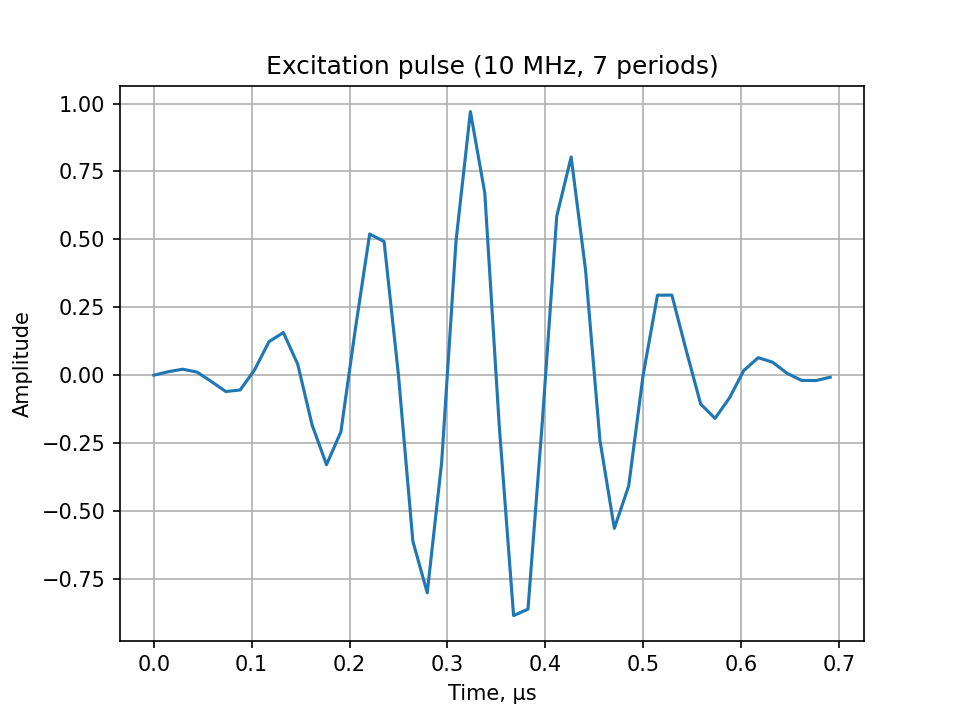

**Рис. 1.** Зондувальний імпульс за параметрами таблиці 1

Поряд із прямою реалізацією формули (1) у `backscatter/pulse.py` модуль `backscatter/pulse_scipy.py` будує той самий імпульс через бібліотечну функцію `scipy.signal.gausspulse` [2]. Оскільки вона параметризована відносною смугою пропускання, а не тривалістю, ширина обвідної (2) перераховується у смугу за співвідношенням $bw = \sqrt{-2\ln r}\,/(\pi f_0 \sigma)$, де $r = 10^{-6/20}$ — рівень відліку $-6$ дБ; додатково обвідна зсувається в центр вікна, а косинусне заповнення зводиться до синусного з формули (1). Обидві реалізації збігаються з машинною точністю ($\sim 10^{-15}$), що слугує взаємною перевіркою.

## 2. Модель зразка: періодичні донні відбиття

Розглядається плоскопаралельний сталевий зразок товщиною $d$, на зовнішній поверхні якого встановлено перетворювач (рис. 2). Зондувальний імпульс поширюється в товщу зразка, відбивається від внутрішньої (донної) поверхні, повертається до зовнішньої поверхні, де реєструється перетворювачем, знову відбивається всередину зразка — і цикл повторюється, доки імпульс повністю не загасне.

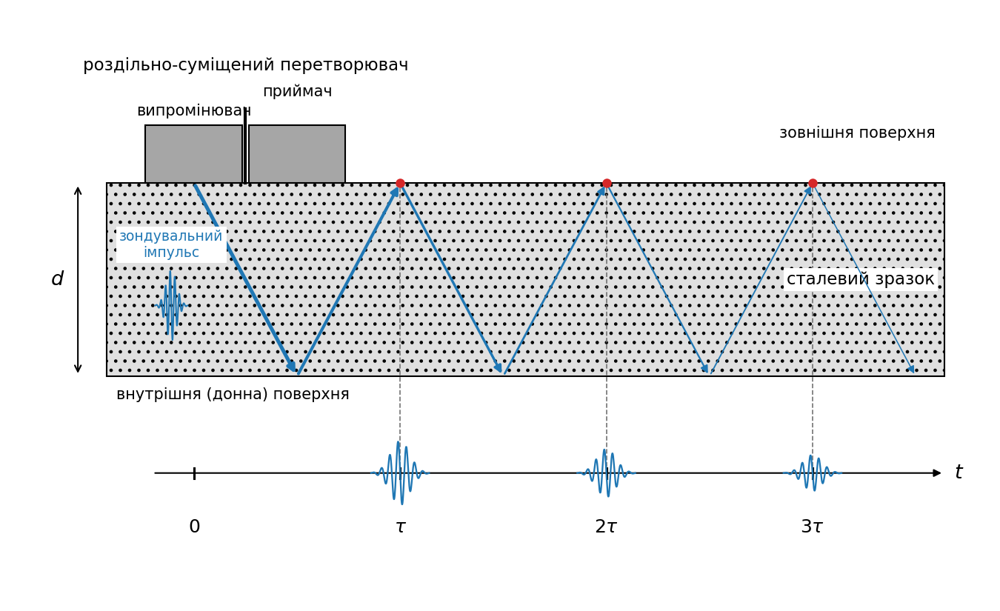

**Рис. 2.** Схема вимірювання: роздільно-суміщений перетворювач на зовнішній поверхні плоскопаралельного зразка та шлях поширення імпульсу, розгорнутий уздовж осі часу $t$. Кут нахилу променів — умовність зображення: по горизонталі відкладено час, по вертикалі — координату по товщині зразка, а хвиля насправді поширюється за нормаллю до поверхні. Стоншення стрілок відповідає загасанню (4); червоні точки та штрихові лінії позначають моменти реєстрації відбиттів $t_k = k\tau$ згідно з (3), а на осі часу схематично показано зареєстровану ехо-серію зі спадом амплітуди згідно з (4)

Таким чином, $k$-те відбиття долає шлях $2dk$ і надходить у момент

$$
t_k = k\,\tau, \qquad \tau = \frac{2d}{c},
\qquad (3)
$$

де $c$ — швидкість поздовжньої хвилі в матеріалі, а $\tau$ — час одного обігу «туди й назад». Амплітуда $k$-го відбиття визначається загасанням, накопиченим уздовж пройденого шляху:

$$
A_k = 10^{-\alpha \cdot 2 d k / 20},
\qquad (4)
$$

де $\alpha$ — коефіцієнт загасання в дБ/м на частоті заповнення. Відбиття додаються до результівного сигналу, доки $A_k$ не впаде нижче $10^{-4}$ ($-80$ дБ) або чергове відбиття не вийде за межі вікна спостереження.

У реалізації серію відбиттів узагальнено на довільний частковий відбивач (розсіювач) на глибині $z$ з амплітудним коефіцієнтом відбиття $r$: відбиття надходять у моменти $t_k = k \cdot 2z/c$ з амплітудами $A_k = r^k \cdot 10^{-\alpha \cdot 2zk/20}$, оскільки за кожен обіг хвиля один раз відбивається від розсіювача (функція `add_scatterer_echoes`, модуль `backscatter/echoes.py`). Донна поверхня — окремий випадок $z = d$, $r = 1$ (функція-обгортка `add_backwall_echoes`). Це закладає основу для моделювання дефектів, клейових покриттів та інших шарів у наступних етапах.

Прийняті на цьому етапі робочі припущення:

- обидві межі (сталь–повітря) вважаються ідеальними відбивачами ($|R| \approx 1$), втрати на відбиття не враховуються;
- загасання задано скаляром на частоті заповнення $f_0$; частотна залежність у межах смуги імпульсу відкладена (див. план розвитку);
- моменти надходження відбиттів округлюються до найближчого відліку (похибка $< T_s/2 \approx 7{,}4$ нс);
- розбіжність пучка (дифракційні втрати) не моделюється.

Параметри моделі за замовчуванням наведено в таблиці 2. Швидкість поздовжньої хвилі у сталі $c = 5920$ м/с [5]; для конкретних марок довідники подають близькі значення (наприклад, $5890$ м/с для сталі 1020 [6]). Коефіцієнт загасання поздовжніх хвиль у вуглецевих сталях лежить у діапазоні $0{,}7$–$3{,}5$ дБ/(м·МГц) [7], що на частоті $10$ МГц відповідає $7$–$35$ дБ/м; за замовчуванням прийнято середину діапазону $20$ дБ/м.

**Таблиця 2.** Параметри моделі зразка за замовчуванням

| Параметр | Позначення | Значення |
|---|---|---|
| Товщина зразка | $d$ | $10\ \text{мм}$ |
| Швидкість поздовжньої хвилі | $c$ | $5920\ \text{м/с}$ [5, 6] |
| Коефіцієнт загасання | $\alpha$ | $20\ \text{дБ/м}$ [7] |
| Довжина сигналу | $N_s$ | $1400$ відліків |

Синтезований сигнал показано на рис. 3.

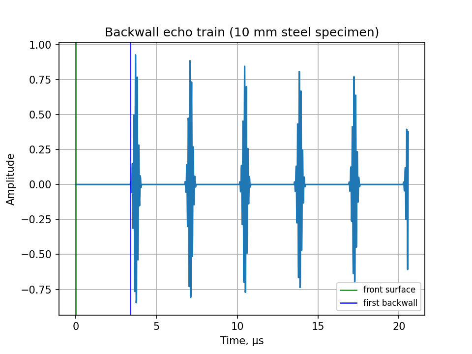

**Рис. 3.** Синтезований сигнал із періодичними донними відбиттями за параметрами таблиць 1 і 2

У вікні спостереження $N_s / f_s \approx 20{,}6$ мкс вміщується шість відбиттів із періодом $\tau \approx 3{,}38$ мкс. За замовчуванням загасання за один обіг становить $2\alpha d = 0{,}4$ дБ, тому спад амплітуди в межах вікна повільний ($\approx 2{,}4$ дБ); помітно швидший спад реальних ехо-серій зумовлений насамперед втратами на відбиття та дифракційними втратами, які буде додано на наступних етапах.

## 3. Перетворювач із призмою (лінією затримки)

Конструктивно п'єзоелемент приклеєно до верхньої грані призми з оргскла (ПММА) товщиною $h$; нижня грань призми контактує зі сталевим зразком (рис. 4). Згенерований п'єзоелементом зондувальний імпульс проходить крізь призму; на межі оргскло–сталь частина енергії проходить у зразок і далі поводиться згідно з моделлю розділу 2, а решта відбивається назад у призму. Частку енергії, що проходить у сталь, позначимо $T$; за робочим припущенням проєкту $T = 0{,}8$ (у реальному контакті ця частка визначається акустичними імпедансами та станом контактної поверхні й на наступних етапах буде рандомізована).

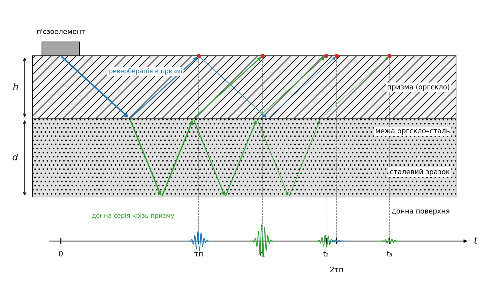

**Рис. 4.** Схема перетворювача з призмою: п'єзоелемент на верхній грані призми, нижня грань контактує зі сталевим зразком; шлях імпульсу розгорнуто вздовж осі часу, як на рис. 2. Сині промені — реверберація в призмі, зелені — донна серія, спостережувана крізь призму; нахили променів різні через різні швидкості звуку в оргсклі та сталі. На осі часу показано зареєстровані імпульси обох родин: τп — період реверберації призми, t₁, t₂, t₃ — донні відбиття; амплітуди відповідають моделі цього розділу

Уточнимо, про яку амплітуду йтиметься далі. Хвилю можна описувати кількома величинами — акустичним тиском, коливальною швидкістю чи зміщенням частинок; під амплітудою тут і далі розуміємо амплітуду акустичного (надлишкового) тиску $p = P - P_0$, тобто спричиненого хвилею відхилення тиску від статичного значення; у плоскій хвилі тиск і коливальна швидкість пов'язані співвідношенням $p = Zv$ [12]. Вибір тиску природний, бо саме тиск (механічне напруження) реєструє п'єзоелемент, отже синтезований сигнал моделює акустичний тиск, і всі амплітудні коефіцієнти цього розділу — коефіцієнти за тиском. Амплітудний коефіцієнт відбиття від межі

$$
r = \sqrt{1 - T}
\qquad (5)
$$

для $T = 0{,}8$ становить $r \approx 0{,}447$. Формула (5) випливає з того, що енергетичний (інтенсивнісний) коефіцієнт відбиття дорівнює квадратові амплітудного: $R = r^2$ [10], а на межі без поглинання $R + T = 1$. Для донної серії потрібен ще добуток амплітудних коефіцієнтів проходження «туди й назад»: за співвідношеннями Стокса $t_{\downarrow} = 1 + r$, $t_{\uparrow} = 1 + r' = 1 - r$ (коефіцієнт відбиття з протилежного боку межі $r' = -r$; співвідношення випливають із неперервності поля на межі та оберненості процесу в часі) [11], звідки

$$
t_{\downarrow} t_{\uparrow} = (1+r)(1-r) = 1 - r^2 = T,
\qquad (6)
$$

тобто дворазове перетинання межі послаблює амплітуду рівно в $T$ разів — саме цей множник фігурує у формулі (8).

Цей результат має просте енергетичне пояснення. Енергетичний коефіцієнт проходження — це відношення: яка б енергія не падала на межу, крізь неї проходить частка $T$; для нормального падіння $T = 4Z_1Z_2/(Z_1+Z_2)^2$, де $Z_1$, $Z_2$ — акустичні імпеданси середовищ [12]. Донне відбиття перетинає ту саму межу двічі, але в протилежних напрямках, тож апріорі коефіцієнти могли б відрізнятися. Однак коефіцієнт зворотного проходження $T_{21}$ отримується з $T_{12}$ заміною позначень $Z_1 \leftrightarrow Z_2$, яка не змінює ані добутку $Z_1 Z_2$, ані суми $Z_1 + Z_2$: отже, $T_{21} = T_{12} = T$. Хвиля, що повертається від донної поверхні, для межі є просто новою падаючою хвилею (імпульс короткий, тож пряме та зворотне поля на межі не перекриваються й не інтерферують — у згоді з прийнятим наближенням шляхів першого порядку), і послідовні проходження перемножуються: після двох перетинань від енергії імпульсу залишається частка $T \cdot T = T^2$. Але хвиля, що вирушила в сталь, і хвиля, що повернулася, поширюються в одному й тому самому середовищі (призмі), а в межах одного середовища енергія пропорційна квадратові амплітуди з тим самим коефіцієнтом. Отже, амплітудний множник дорівнює $\sqrt{T^2} = T$.

Підкреслимо, що поодинокі амплітудні коефіцієнти при цьому несиметричні й «неенергетичні»: при переході в середовище з більшим імпедансом амплітуда тиску навіть зростає, $t_{\downarrow} = 1 + r > 1$, що не порушує збереження енергії, бо енергія визначається квадратом амплітуди, помноженим на імпедансний коефіцієнт середовища [11]. Зауважимо також, що значення коефіцієнтів залежать від обраної величини опису хвилі: для коливальної швидкості вони інші (проходження $1 - r$, відбиття $-r$ [12]), і лише енергетичні співвідношення на кшталт (6) від цього вибору не залежать. На зворотному шляху асиметрія точно компенсується: для $T = 0{,}8$ маємо $r \approx 0{,}447$, $t_{\downarrow} \approx 1{,}447$, $t_{\uparrow} \approx 0{,}553$ і $t_{\downarrow} t_{\uparrow} = 1{,}447 \cdot 0{,}553 = 0{,}800 = T$.

Прийнятий сигнал складається з двох родин відбиттів (рис. 4):

1) **реверберація в призмі** — імпульс багаторазово відбивається між верхньою гранню (п'єзоелемент, $|R| \approx 1$) та межею оргскло–сталь; $j$-те відбиття надходить у момент $t_j = j \cdot 2h/c_p$ з амплітудою

$$
B_j = r^{\,j} \, 10^{-\alpha_p \cdot 2 h j / 20};
\qquad (7)
$$

2) **серія донних відбиттів розділу 2, спостережувана крізь призму**: кожне $k$-те відбиття двічі перетинає межу (множник $T$), двічі проходить призму (множник $10^{-\alpha_p \cdot 2h/20}$, затримка $2h/c_p$) та $k-1$ разів відбивається від межі назад у сталь (множник $r^{k-1}$):

$$
A_k = T \, r^{\,k-1} \, 10^{-\alpha_p \cdot 2h/20} \, 10^{-\alpha \cdot 2dk/20},
\qquad t_k = \frac{2h}{c_p} + k\,\frac{2d}{c}.
\qquad (8)
$$

Змішані шляхи вищих порядків (реверберації призми, що повторно проходять у сталь, і навпаки) на цьому етапі нехтуються; верхня грань призми вважається ідеальним відбивачем.

Параметри призми за замовчуванням наведено в таблиці 3. Товщина призми $h = 10$ мм відповідає типовим серійним лініям затримки: стандартні змінні акрилові лінії затримки серії DLH мають довжину від $5{,}6$ до $12{,}7$ мм ($0{,}22$–$0{,}50$ дюйма), а затримки серійних перетворювачів із вбудованою лінією становлять $1{,}5$–$6{,}75$ мкс [9] проти $3{,}66$ мкс у нашій моделі. Швидкість поздовжньої хвилі в оргсклі $c_p = 2730$ м/с [6] (довідник [8] подає $2750$ м/с для Plexiglas G). Загасання в оргсклі значно більше, ніж у сталі: довідник [8] подає $6{,}4$ дБ/см на частоті $5$ МГц, тобто $640$ дБ/м; це значення прийнято як робоче на частоті заповнення (частотне масштабування загасання відкладено — див. план розвитку).

**Таблиця 3.** Параметри моделі перетворювача за замовчуванням

| Параметр | Позначення | Значення |
|---|---|---|
| Товщина призми | $h$ | $10\ \text{мм}$ |
| Швидкість поздовжньої хвилі в оргсклі | $c_p$ | $2730\ \text{м/с}$ [6, 8] |
| Коефіцієнт загасання в оргсклі | $\alpha_p$ | $640\ \text{дБ/м}$ [8] |
| Частка енергії, що проходить у сталь | $T$ | $0{,}8$ (робоче припущення) |

Обидві родини побудовано узагальненою функцією `add_scatterer_echoes` (модуль `backscatter/echoes.py`), яка приймає множник передачі $S$ і зсув часу $t_0$: для реверберації призми $S = 1$, $t_0 = 0$; для донної серії $S = T \cdot 10^{-\alpha_p \cdot 2h/20}/r$, $t_0 = 2h/c_p$. Синтезований сигнал показано на рис. 5.

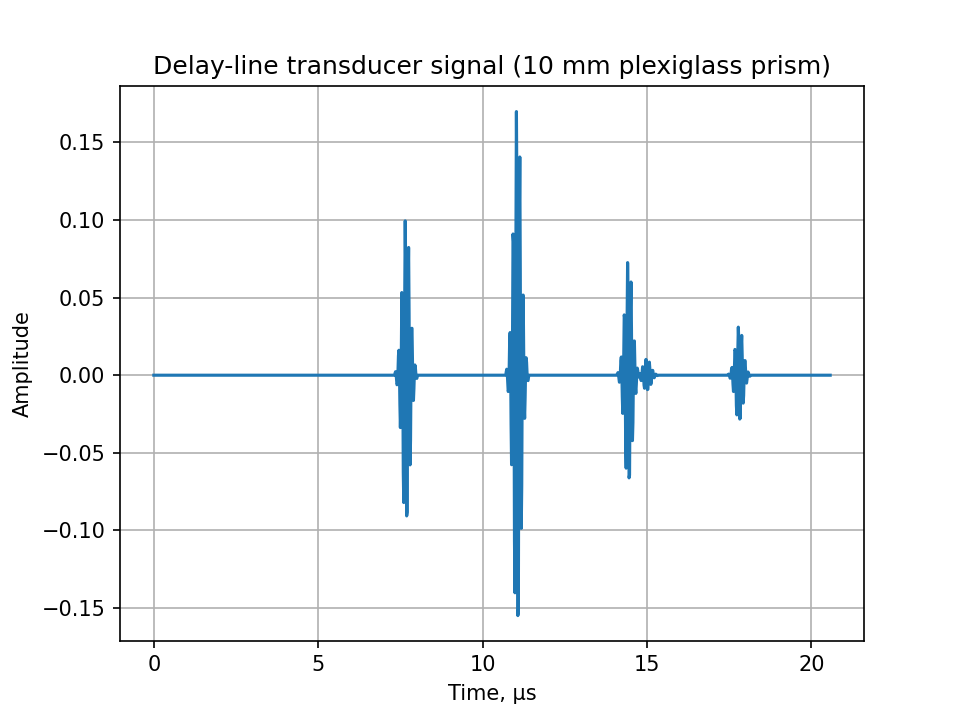

**Рис. 5.** Синтезований сигнал перетворювача з призмою за параметрами таблиць 1–3

На рис. 5 видно обидві родини відбиттів: перше відбиття від межі оргскло–сталь надходить при $\approx 7{,}3$ мкс, перше донне — при $\approx 10{,}7$ мкс, третє донне — при $\approx 17{,}5$ мкс; поблизу $14$–$15$ мкс друге донне відбиття ($\approx 14{,}1$ мкс) частково накладається на друге відбиття від межі ($\approx 14{,}7$ мкс). Такі накладання — прямий наслідок співвідношення між часом обігу призми та зразка, і саме їх доводиться враховувати, узгоджуючи товщину призми з товщиною контрольованого виробу.

## 4. Акустичний контакт між призмою та зразком

У розділі 3 частку енергії $T$, що проходить крізь межу оргскло–сталь, було задано робочим значенням $0{,}8$. Оцінимо тепер її фізично обґрунтовану величину з акустичних імпедансів середовищ. Енергетичний коефіцієнт проходження плоскої межі при нормальному падінні (він уже фігурував у розділі 3)

$$
T = \frac{4 Z_1 Z_2}{(Z_1 + Z_2)^2},
\qquad (9)
$$

де $Z = \rho c$ — акустичний імпеданс середовища ($\rho$ — густина, $c$ — швидкість звуку) [12]. Потрібні значення імпедансів зібрано в таблиці 4.

**Таблиця 4.** Акустичні імпеданси контактних середовищ

| Середовище | $Z$, МРел | Джерело |
|---|---|---|
| Сталь маловуглецева | $46{,}0$ | [13] |
| Оргскло (Plexiglas G) | $3{,}26$ | [8] |
| Гліцерин | $2{,}34$ | [14] |
| Вода (20 °C) | $1{,}48$ | [14] |
| Олива мінеральна | $1{,}19$–$1{,}23$ | [14] |
| Повітря | $4 \cdot 10^{-4}$ | [12] |

**Ідеальний контакт.** Підстановка імпедансів оргскла та сталі в (9) дає $T = 4 \cdot 3{,}26 \cdot 46{,}0 / (3{,}26 + 46{,}0)^2 \approx 0{,}25$ ($-6{,}1$ дБ), чому відповідає $r \approx 0{,}87$. Це — фізична межа для щільного (ідеального) контакту оргскло–сталь. Отже, робоче значення $T = 0{,}8$ з таблиці 3 є свідомо завищеним; фізично обґрунтований діапазон становить приблизно $0{,}1$–$0{,}25$ (див. нижче), і саме в цих межах коефіцієнт буде рандомізовано на наступних етапах.

**Сухий контакт.** Реальні поверхні шорсткі, тому без рідини між призмою та зразком лишається повітряний прошарок. Контраст імпедансів пари тверде тіло–повітря колосальний: сама лише межа сталь–повітря пропускає за (9) $T \approx 3{,}5 \cdot 10^{-5}$ ($-45$ дБ). До того ж за тонкошаровою оцінкою [12] прошарок стає акустично прозорим лише за товщини $d \ll v/(\pi f)$, що для повітря на частоті $10$ МГц становить $\approx 11$ мкм — порядку шорсткості оброблених поверхонь. Тому сухий контакт практично не пропускає ультразвук у зразок.

**Контактна рідина.** Рідина (гліцерин, гель, олива, вода) витісняє повітря з мікронерівностей і замінює пари меж «тверде–повітря» на «тверде–рідина» з незрівнянно меншим контрастом імпедансів; застосування контактної рідини практично завжди необхідне для акустичного зв'язку перетворювача з виробом [9]. Робоча плівка рідини тонка [9]: за товщини в одиниці–десятки мікрометрів (оцінка; фактична товщина визначається шорсткістю та притиском) вона значно менша від масштабу прозорості $v/(\pi f) \approx 47$ мкм для води та $\approx 61$ мкм для гліцерину, тож шар майже прозорий, і $T$ наближається до межі ідеального контакту $\approx 0{,}25$. Протилежна, нижня, оцінка — «товстий» шар із незалежними межами: добуток коефіцієнтів (9) для пар оргскло–рідина та рідина–сталь дає $0{,}97 \cdot 0{,}18 \approx 0{,}18$ для гліцерину та $0{,}86 \cdot 0{,}12 \approx 0{,}10$ для води. Побіжно видно й практичне правило: що більший імпеданс рідини, то ефективніший контакт — саме тому в'язкий гліцерин із високим імпедансом рекомендують для шорстких поверхонь [9].

Отже, реалістичний діапазон коефіцієнта проходження контакту через рідину — приблизно $T \approx 0{,}1$–$0{,}25$, а його мінливість від вимірювання до вимірювання (притиск, кількість рідини, стан поверхні) є фізичним підґрунтям запланованої рандомізації $T$ (див. план розвитку). У коді формулу (9) реалізує функція `interface_transmitted_energy` (модуль `backscatter/transducer.py`), а імпеданси таблиці 4 доступні як константи цього модуля; значення за замовчуванням $T = 0{,}8$ поки лишається незмінним.

Вплив стану контакту на сигнал моделі розділу 3 ілюструє рис. 6: сигнали для трьох значень $T$ із фізично обґрунтованого діапазону показано на окремих панелях з однаковими масштабами осей, що робить амплітуди безпосередньо порівнянними.

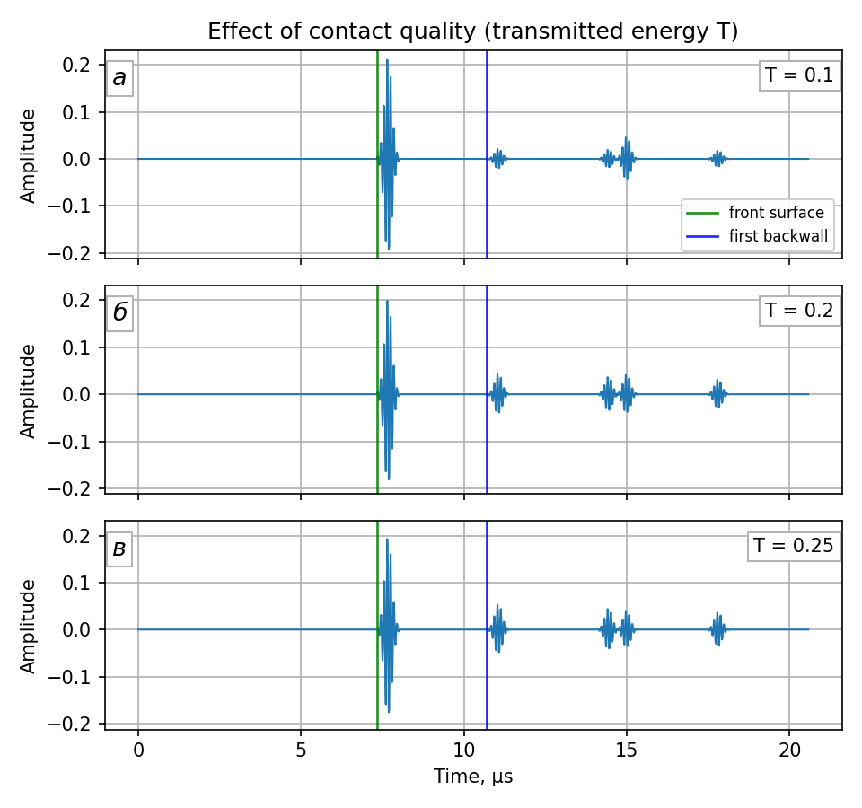

**Рис. 6.** Сигнали моделі розділу 3 за різної якості контакту: а — $T = 0{,}1$; б — $T = 0{,}2$; в — $T = 0{,}25$ (решта параметрів — за таблицями 1–3)

Порівняння показує характерну асиметрію. Амплітуда першого донного відбиття за (8) пропорційна $T$ і тому змінюється в $2{,}5$ раза в межах діапазону ($0{,}022$–$0{,}055$). Натомість перше відбиття від межі за (7) пропорційне $r = \sqrt{1-T}$, яке в тому самому діапазоні змінюється лише від $0{,}95$ до $0{,}87$, — його амплітуда майже нечутлива до стану контакту; помітніше зростає хіба що друга реверберація призми ($\propto r^2$, $\approx 15{,}1$ мкс). Практичний висновок: індикатором якості акустичного контакту слугує саме амплітуда донної серії (або її відношення до міжового відбиття), і саме на донну серію найсильніше впливатиме майбутня рандомізація $T$.

## 5. Дефект у зразку

Ускладнимо модель зразка: на глибині $z_f < d$ під зовнішньою поверхнею залягає плоский дефект, який відбиває назад частку $R_f$ енергії, що на нього падає, а решту $1 - R_f$ пропускає далі до донної поверхні (рис. 7). За аналогією з розділом 3, амплітудний коефіцієнт відбиття від дефекту дорівнює $r_f = \sqrt{R_f}$ (з огляду на $R = r^2$ [10]), а добуток амплітудних коефіцієнтів проходження крізь дефект «вниз і вгору» за співвідношенням Стокса (6) становить $1 - r_f^2 = T_f$, де $T_f = 1 - R_f$. Отже, кожен обіг, що двічі перетинає дефект, зберігає амплітудний множник $T_f$.

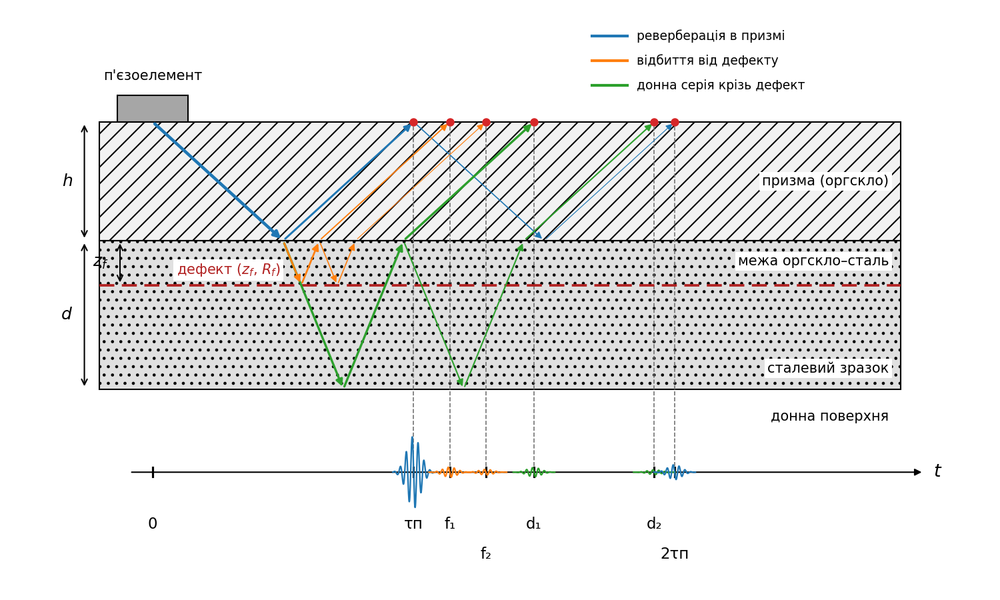

**Рис. 7.** Схема сценарію з дефектом у розгортці вздовж осі часу (як на рис. 2 і 4): реверберація призми (сині промені), відбиття від дефекту (жовтогарячі), донна серія крізь дефект (зелені); штрихова лінія — дефект на глибині $z_f$. За $z_f = 0{,}3\,d$ дефектна серія (f₁, f₂) і донна (d₁, d₂) розділені в часі: періоди $2z_f/c$ та $2d/c$ не кратні

Прийнятий сигнал тепер складається з трьох родин відбиттів (рис. 7). Реверберація в призмі описується, як і раніше, формулою (7). Друга родина — реверберація між межею оргскло–сталь і дефектом: $k$-те відбиття $k$ разів відбивається від дефекту та $k-1$ разів від межі,

$$
A_k^{(f)} = T \, r^{\,k-1} r_f^{\,k} \, 10^{-\alpha_p \cdot 2h/20} \, 10^{-\alpha \cdot 2 z_f k/20},
\qquad t_k^{(f)} = \frac{2h}{c_p} + k\,\frac{2 z_f}{c}.
\qquad (10)
$$

Третя родина — донна серія, яка при кожному обігу додатково двічі перетинає дефект:

$$
A_k^{(d)} = T \, r^{\,k-1} T_f^{\,k} \, 10^{-\alpha_p \cdot 2h/20} \, 10^{-\alpha \cdot 2dk/20},
\qquad t_k^{(d)} = \frac{2h}{c_p} + k\,\frac{2d}{c}.
\qquad (11)
$$

За $R_f = 0$ друга родина зникає, а третя зводиться до моделі розділу 3 (це перевірено чисельно з машинною точністю). Реверберації між дефектом і донною поверхнею (другого порядку за $r_f$) та інші змішані шляхи на цьому етапі знехтувано; дефект вважається плоским частковим відбивачем, що перекриває весь переріз пучка.

Параметри сценарію наведено в таблиці 5: глибина та відбивна здатність дефекту — робочі значення за завданням, коефіцієнт проходження контакту $T = 0{,}2$ взято з фізично обґрунтованого діапазону розділу 4.

**Таблиця 5.** Параметри сценарію з дефектом

| Параметр | Позначення | Значення |
|---|---|---|
| Глибина дефекту | $z_f$ | $3\ \text{мм}$ (робоче припущення) |
| Частка відбитої дефектом енергії | $R_f$ | $0{,}4$ (робоче припущення) |
| Частка енергії крізь контакт | $T$ | $0{,}2$ (розділ 4) |

Усі три родини реалізовано функцією `synthesize_flaw_signal` (модуль `backscatter/flaw.py`) через ту саму узагальнену серію `add_scatterer_echoes`: коефіцієнти відбиття обігу дорівнюють $r$ для призми, $r_f\,r$ для пари межа–дефект і $T_f\,r$ для донної серії крізь дефект, зі спільним множником передачі $S = T \cdot 10^{-\alpha_p \cdot 2h/20}/r$. Порівняння сигналів без дефекту та з дефектом показано на рис. 8.

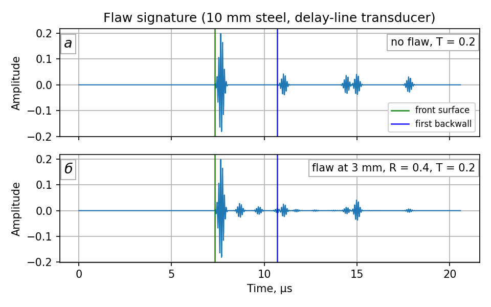

**Рис. 8.** Сигнали перетворювача: а — без дефекту; б — з дефектом на глибині $3$ мм ($R_f = 0{,}4$); параметри — за таблицями 1–3, 5

Дефект видає себе двома ознаками одразу. По-перше, з'являються додаткові відбиття: перше дефектне — на $\approx 8{,}3$ мкс, між міжовим ($7{,}3$ мкс) і першим донним ($10{,}7$ мкс), а наступні йдуть із власним періодом $2z_f/c \approx 1{,}0$ мкс і швидко згасають (множник $r_f\,r \approx 0{,}57$ за обіг). По-друге, донна серія ослаблюється множником $T_f^{\,k} = 0{,}6^k$. Обидві ознаки — поява проміжних відбиттів і ослаблення донного сигналу — є класичними інформативними ознаками дефектоскопії, і саме їх майбутні етапи (пори, структурний шум) розвиватимуть далі.

Залежність картини від глибини залягання дефекту ілюструє рис. 9, де сигнали для $z_f$ від $3$ до $7$ мм показано на панелях з однаковими масштабами осей.

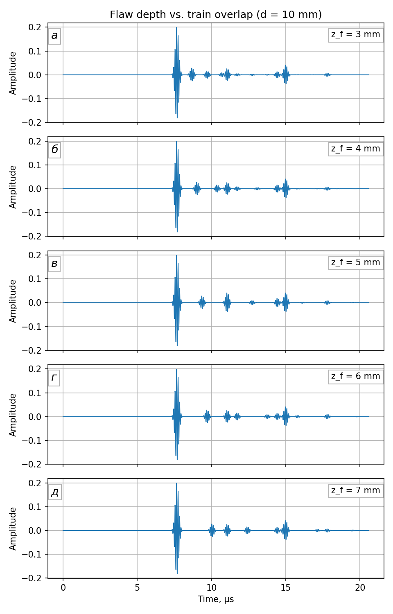

**Рис. 9.** Сигнали для різних глибин залягання дефекту: а — $z_f = 3$ мм; б — $4$ мм; в — $5$ мм; г — $6$ мм; д — $7$ мм ($d = 10$ мм; решта параметрів — за таблицями 1–3, 5)

За $z_f = 3$, $4$, $6$, $7$ мм дефектна та донна серії розділені: між донними відбиттями видно окремі дефектні піки, положення яких однозначно визначає глибину залягання. Особливим є випадок $z_f = d/2 = 5$ мм (рис. 9, в): період дефектної серії $2z_f/c$ дорівнює точно половині періоду донної, тому кожне парне дефектне відбиття припадає на донне й синфазно підсилює його, а непарні лягають рівно посередині між донними — серії зливаються в одну регулярну послідовність із половинним періодом. Така картина не відрізняється від сигналу бездефектного зразка половинної товщини $d/2$, що є класичним джерелом неоднозначності у товщинометрії; розділити ці випадки допомагає аналіз амплітудних співвідношень (у нашій моделі — множники $r_f r$ проти $T_f r$ за обіг) або вимірювання з іншої поверхні.

Розглянемо насамкінець протилежний граничний випадок — приповерхневий дефект, глибина якого значно менша за просторову довжину імпульсу. Просторова довжина зондувального імпульсу в сталі становить $L = c \cdot N/f_0 = 5920 \cdot 0{,}7\ \text{мкс} \approx 4{,}1$ мм. Візьмемо $z_f = 0{,}3$ мм $\ll L$: час обігу пари межа–дефект $2z_f/c \approx 0{,}101$ мкс майже точно дорівнює періоду заповнення $1/f_0 = 0{,}1$ мкс, тому послідовні відбиття дефектної серії накладаються одне на одне зі зсувом лише в один період — майже синфазно. Замість окремих піків утворюється єдиний подовжений пакет: часткові відбиття підсумовуються як геометрична прогресія зі знаменником $r_f r \approx 0{,}57$, що дає підсилення до $1/(1 - r_f r) \approx 2{,}3$ відносно одиночного відбиття (рис. 10, б).

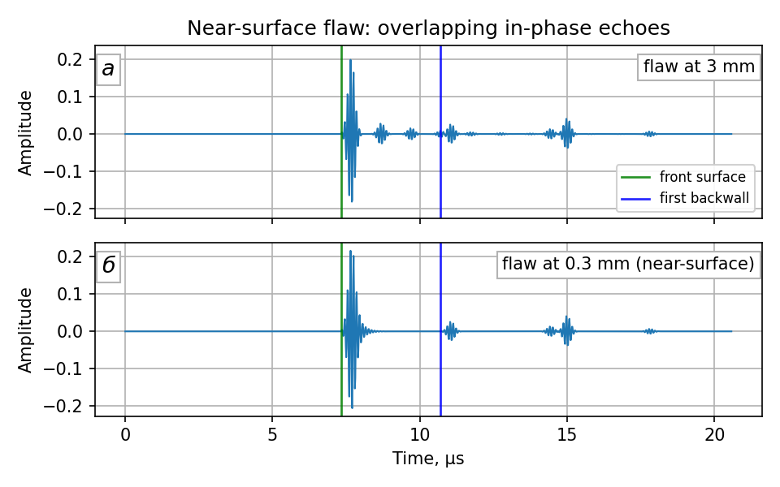

**Рис. 10.** Сигнали з дефектом: а — $z_f = 3$ мм; б — приповерхневий $z_f = 0{,}3$ мм (решта параметрів — за таблицями 1–3, 5)

Збільшений фрагмент в околі міжового відбиття (рис. 11) показує різницю наочно: за $z_f = 3$ мм (рис. 11, а) дефектні відбиття видно як окремі пакети, а за $z_f = 0{,}3$ мм (рис. 11, б) вони зливаються з міжовим відбиттям в один розтягнутий «дзвін», і окремого дефектного еха немає.

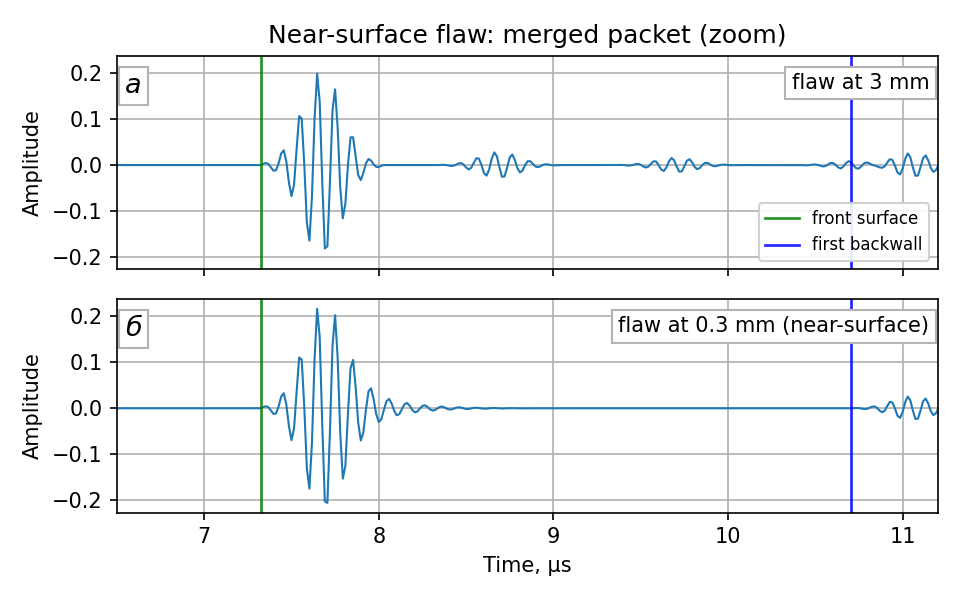

**Рис. 11.** Збільшений фрагмент рис. 10 в околі міжового відбиття: а — $z_f = 3$ мм (окремі дефектні відбиття); б — $z_f = 0{,}3$ мм (злитий майже синфазний пакет)

Це модельний прояв класичної проблеми приповерхневої роздільної здатності («мертвої зони»): приповерхневий дефект не дає окремого еха, і його практичними ознаками слугують розтягування міжового пакета та ослаблення донної серії (множник $T_f^{\,k}$, як і раніше). Саме заради приповерхневої роздільної здатності й застосовують перетворювачі з лініями затримки [9]; здатність розділити тонкий приповерхневий шар обмежується тривалістю імпульсу, що напряму мотивує вибір короткого зондувального імпульсу (розділ 1).

Для субхвильових глибин результат накладання визначається інтерференцією: послідовні відбиття дефектної серії зсунуті одне відносно одного на фазу обігу

$$
\varphi = 2\pi\,\frac{2 z_f}{\lambda},
\qquad \lambda = \frac{c}{f_0},
\qquad (12)
$$

де $\lambda \approx 592$ мкм — довжина хвилі в сталі на частоті $10$ МГц. Зауважимо, що обидва відбиття, які формують обіг (від дефекту та від межі оргскло–сталь із боку сталі), є «м'якими» — за ними лежить середовище з меншим імпедансом, тому кожне інвертує фазу хвилі [12], а їхня пара за повний обіг фазу не змінює: інтерференційні умови визначає лише $\varphi$. Відтак послідовні відбиття додаються синфазно ($\varphi = 2\pi m$) на глибинах $z_f = m\,\lambda/2$ і протифазно ($\varphi = \pi(2m-1)$) на глибинах $z_f = (2m-1)\,\lambda/4$. Геометрична сума серії дає підсилення $1/(1 - r_f r) \approx 2{,}3$ у синфазному випадку та ослаблення $1/(1 + r_f r) \approx 0{,}64$ у протифазному ($r_f r \approx 0{,}57$). Ці три випадки показано на рис. 12.

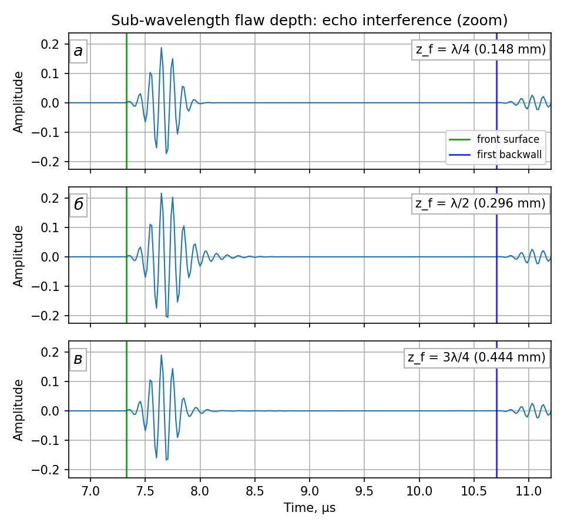

**Рис. 12.** Збільшений фрагмент сигналу в околі міжового відбиття для субхвильових глибин дефекту: а — $z_f = \lambda/4$ ($0{,}148$ мм, протифаза); б — $z_f = \lambda/2$ ($0{,}296$ мм, синфаза); в — $z_f = 3\lambda/4$ ($0{,}444$ мм, протифаза)

На рис. 12, б синфазне накладання дає підвищений пік і довгий «дзвін» після міжового відбиття, тоді як на рис. 12, а, в дефектна серія самопригнічується, і пакет майже збігається з міжовим відбиттям бездефектного випадку — дефект на таких глибинах стає практично «прозорим» для луна-методу. Підкреслимо два застереження. По-перше, для часткового відбивача ($r_f < 1$) повного занулення немає — протифазна сума обмежена множником $1/(1+r_f r)$, а точний нуль відбиття досягається лише в ідеалізованій задачі про тонкий шар у неперервному режимі; по-друге, у дискретній моделі затримки округлюються до відліку (розділ 2), що частково розмиває точні фазові умови ($\pm 26°$ на періоді заповнення). Практичний висновок для студента: чутливість луна-методу до субхвильових дефектів осцилює з глибиною з періодом $\lambda/2$, і саме тому виявлення таких дефектів потребує широкосмугових (коротких) імпульсів, для яких інтерференційні мінімуми різних частот не збігаються.

## Структура проєкту

```
main.py                      точка входу: будує сигнальний тракт, зберігає графіки
backscatter/
    pulse.py                 генерація зондувального імпульсу (пряма реалізація формули (1))
    pulse_scipy.py           той самий імпульс через scipy.signal.gausspulse (перехресна перевірка)
    echoes.py                узагальнена серія відбиттів від відбивача на заданій глибині
                             (формули (3), (4) з множником S та зсувом t0)
    specimen.py              модель зразка: донні відбиття — окремий випадок серії з r = 1
    transducer.py            перетворювач із призмою: реверберація призми та донна серія
                             крізь призму (формули (5)–(9))
    flaw.py                  зразок із дефектом: три родини відбиттів (формули (10), (11))
    schematic.py             схеми вимірювання (рис. 2, 4 і 7)
    visualization.py         допоміжні функції візуалізації (matplotlib)
images/                      згенеровані рисунки
```

## Використання

Потрібен Python ≥ 3.10 з NumPy, SciPy та matplotlib:

```
pip install -r requirements.txt
python main.py
```

Згенеровані рисунки записуються до каталогу `images/`.

Модулі можна використовувати й безпосередньо:

```python
from backscatter.pulse import generate_pulse
from backscatter.specimen import add_backwall_echoes
from backscatter.transducer import synthesize_transducer_signal

t, s = generate_pulse(frequency=10e6, sample_rate=68e6, n_periods=7)
t, bare = add_backwall_echoes(s, thickness=10e-3)   # зразок без призми (розділ 2)
t, full = synthesize_transducer_signal(s)           # призма + зразок (розділ 3)
```

Функції повертають пару масивів однакової довжини; `t` задано в секундах, геометричні розміри — в метрах.

## План розвитку

Заплановані етапи моделі відповідно до фізичного сигнального тракту роздільно-суміщеного перетворювача:

1. ~~Зондувальний імпульс~~ (виконано)
2. ~~Модель зразка: періодичні донні відбиття із загасанням~~ (виконано)
3. ~~Перетворювач із призмою (лінією затримки): реверберація та проходження у зразок~~ (виконано)
4. ~~Оцінка акустичного контакту та вплив контактної рідини~~ (виконано)
5. ~~Плоский дефект як частковий відбивач у зразку~~ (виконано)
6. Імпульсна характеристика перетворювача (електромеханічна передача випромінювального та приймального елементів)
7. Уточнення моделі поширення: частотно залежне загасання, випадковий коефіцієнт проходження межі в діапазоні $0{,}1$–$0{,}25$ (розділ 4), дифракційні втрати, субдискретні затримки
8. Модель відбивачів/розсіювачів: пори, структурний шум, реверберації дефект–дно
9. Приймальний тракт: шум, підсилення, оцифрування

## Огляд споріднених досліджень

Синтез ультразвукових сигналів і його застосування для навчання систем ШІ розвиваються у трьох взаємопов'язаних напрямах: фізичні моделі сигналу (вимірювальні моделі та параметричні моделі ехо-сигналів), програмні платформи моделювання для масової генерації синтетичних даних та власне методи машинного навчання, треновані на синтетичних або аугментованих даних. Ключові праці зібрано в таблиці 6; дані станом на липень 2026 року: кількість цитувань — за Crossref [14], квартилі — за SJR 2024 [13].

**Таблиця 6.** Споріднені дослідження: моделювання ультразвукових сигналів і ШІ в ультразвуковому контролі

| Рік | Публікація | Автори | Видання | Цит. | Квартиль |
|---|---|---|---|---|---|
| 1983 | [A model relating ultrasonic scattering measurements through liquid–solid interfaces to unbounded medium scattering amplitudes](https://doi.org/10.1121/1.390045) | R. B. Thompson, T. A. Gray | [J. Acoust. Soc. Am.](https://pubs.aip.org/asa/jasa) | 188 | Q1 |
| 2001 | [Model-based estimation of ultrasonic echoes. Part I: Analysis and algorithms](https://doi.org/10.1109/58.920713) | R. Demirli, J. Saniie | [IEEE Trans. UFFC](https://ieeexplore.ieee.org/xpl/RecentIssue.jsp?punumber=58) | 256 | Q1 |
| 2006 | [CIVA: An expertise platform for simulation and processing NDT data](https://doi.org/10.1016/j.ultras.2006.05.218) | P. Calmon et al. | [Ultrasonics](https://www.sciencedirect.com/journal/ultrasonics) | 72 | Q1 |
| 2010 | [k-Wave: MATLAB toolbox for the simulation and reconstruction of photoacoustic wave fields](https://doi.org/10.1117/1.3360308) | B. Treeby, B. Cox | [J. Biomedical Optics](https://www.spiedigitallibrary.org/journals/journal-of-biomedical-optics) | 2054 | Q2 |
| 2012 | [Simulation based validation of the detection capacity of an ultrasonic inspection procedure](https://doi.org/10.1016/j.ijfatigue.2011.09.002) | H. Wirdelius, G. Persson | [Int. J. Fatigue](https://www.sciencedirect.com/journal/international-journal-of-fatigue) | 15 | Q1 |
| 2019 | [Convolutional neural network for ultrasonic weldment flaw classification in noisy conditions](https://doi.org/10.1016/j.ultras.2018.12.001) | N. Munir et al. | [Ultrasonics](https://www.sciencedirect.com/journal/ultrasonics) | 167 | Q1 |
| 2021 | [Augmented Ultrasonic Data for Machine Learning](https://doi.org/10.1007/s10921-020-00739-5) | I. Virkkunen et al. | [J. Nondestr. Eval.](https://link.springer.com/journal/10921) | 148 | Q2 |
| 2021 | [Deep Learning for Ultrasonic Crack Characterization in NDE](https://doi.org/10.1109/tuffc.2020.3045847) | R. Pyle et al. | [IEEE Trans. UFFC](https://ieeexplore.ieee.org/xpl/RecentIssue.jsp?punumber=58) | 132 | Q1 |
| 2021 | [Automated Flaw Detection in Multi-channel Phased Array Ultrasonic Data Using Machine Learning](https://doi.org/10.1007/s10921-021-00796-4) | O. Siljama et al. | [J. Nondestr. Eval.](https://link.springer.com/journal/10921) | 64 | Q2 |
| 2022 | [Deep learning in automated ultrasonic NDE — developments, axioms and opportunities](https://doi.org/10.1016/j.ndteint.2022.102703) (огляд) | S. Cantero-Chinchilla et al. | [NDT & E International](https://www.sciencedirect.com/journal/ndt-and-e-international) | 151 | Q1 |
| 2022 | [DPAI: A data-driven simulation-assisted-physics learned AI model for transient ultrasonic wave propagation](https://doi.org/10.1016/j.ultras.2021.106671) | T. Gantala, K. Balasubramaniam | [Ultrasonics](https://www.sciencedirect.com/journal/ultrasonics) | 13 | Q1 |
| 2023 | [Machine learning for ultrasonic nondestructive examination of welding defects: A systematic review](https://doi.org/10.1016/j.ultras.2022.106854) (огляд) | H. Sun, P. Ramuhalli, R. E. Jacob | [Ultrasonics](https://www.sciencedirect.com/journal/ultrasonics) | 90 | Q1 |
| 2024 | [Defect detection using integration of ultrasonic least-squares reverse time migration and generative adversarial network](https://doi.org/10.1080/10589759.2024.2413690) | Y. Fan et al. | [Nondestr. Test. Eval.](https://www.tandfonline.com/journals/gnte20) | 3 | Q2 |
| 2024 | [Rail Flaw Imaging Prototype Based on Improved Ultrasonic Synthetic Aperture Focus Method](https://doi.org/10.32548/2024.me-04371) | J. Huang, F. Lanza di Scalea | [Materials Evaluation](https://www.asnt.org/standards-publications/materials-evaluation) | 0 | Q4 |
| 2026 | [Generating Synthetic Ultrasonic Testing Data with Deep Learning: Comparing Simulated and Deep Learning-Based Flaw Responses](https://doi.org/10.58286/33360) | Watson та ін. | [e-J. Nondestr. Test.](https://www.ndt.net/) | 0 | — |

Розподіл за напрямами такий. Фізичні моделі сигналу заклали Thompson і Gray (вимірювальна модель, 1983) та Demirli і Saniie (параметрична модель А-скана як суми гаусових ехо-імпульсів — математично найближчий опублікований аналог формул (1), (10), (11) цього проєкту). Платформи моделювання (CIVA, SimSUNDT, k-Wave) використовують для масової генерації синтетичних інспекційних даних. Найактивніший напрям 2019–2026 років — машинне навчання для ультразвукового контролю, треноване на синтетичних або аугментованих даних (Virkkunen, Pyle, Siljama, Gantala, Fan), з оглядами Cantero-Chinchilla (2022) і Sun (2023).

Щодо статусу видань: засадничі та найцитованіші праці напряму зосереджені у виданнях Q1–Q2, і це свідчить про високу актуальність тематики. Праці у виданнях нижчих квартилів і в неіндексованих виданнях (Materials Evaluation — Q4; e-Journal of Nondestructive Testing — конференційне видання NDT.net без квартиля) — це переважно найсвіжіші розвідувальні результати 2024–2026 років, які ще не встигли набрати цитувань; їхній низький формальний статус відображає радше новизну та формат видання, ніж релевантність. Ця модель за задумом належить до лінії Demirli–Saniie (легкий параметричний синтезатор ехо-серій) і призначена для генерації розмічених навчальних даних — підхід, безпосередньо продовжуваний у працях Virkkunen, Pyle і Gantala.

## Джерела

1. Schmerr L. W. Jr. *Fundamentals of Ultrasonic Nondestructive Evaluation: A Modeling Approach.* — 2nd ed. — Springer, 2016. — DOI: [10.1007/978-3-319-30463-2](https://link.springer.com/book/10.1007/978-3-319-30463-2)
2. `scipy.signal.gausspulse` — Return a Gaussian modulated sinusoid // SciPy documentation. — [docs.scipy.org/doc/scipy/reference/generated/scipy.signal.gausspulse.html](https://docs.scipy.org/doc/scipy/reference/generated/scipy.signal.gausspulse.html)
3. `gauspuls` — Gaussian-modulated sinusoidal RF pulse // MATLAB Signal Processing Toolbox documentation. — [mathworks.com/help/signal/ref/gauspuls.html](https://www.mathworks.com/help/signal/ref/gauspuls.html)
4. `toneBurst` — Create an enveloped single frequency tone burst // k-Wave: A MATLAB toolbox for the time-domain simulation of acoustic wave fields. — [k-wave.org/documentation/toneBurst.php](http://www.k-wave.org/documentation/toneBurst.php)
5. Basic knowledge about ultrasonic testing // KARL DEUTSCH Prüf- und Messgerätebau. — [karldeutsch.de/ndt-knowledge/basic-knowledge/basic-knowledge-about-ultrasonic-testing](https://www.karldeutsch.de/ndt-knowledge/basic-knowledge/basic-knowledge-about-ultrasonic-testing/?lang=en)
6. Material Sound Velocities // Evident (Olympus) NDT Tutorials: Thickness Gauge. — [ims.evidentscientific.com/en/learn/ndt-tutorials/thickness-gauge/appendices-velocities](https://ims.evidentscientific.com/en/learn/ndt-tutorials/thickness-gauge/appendices-velocities)
7. Ono K. A Comprehensive Report on Ultrasonic Attenuation of Engineering Materials, Including Metals, Ceramics, Polymers, Fiber-Reinforced Composites, Wood, and Rocks // Applied Sciences. — 2020. — Vol. 10, № 7. — Art. 2230. — DOI: [10.3390/app10072230](https://doi.org/10.3390/app10072230)
8. Acoustic Properties of Plastics // Onda Corporation. — 2003. — [ondacorp.com/wp-content/uploads/2020/09/Plastics.pdf](https://www.ondacorp.com/wp-content/uploads/2020/09/Plastics.pdf)
9. Ultrasonic Transducers: Wedges, Cables, Test Blocks (Panametrics catalog) // Olympus Scientific Solutions. — 2019. — pp. 17–19, 40. — [qnde.ca/wp-content/uploads/2022/03/Olympus-Panametrics-UT-Transducers-and-Wedges-Catalogue-2019-08-06.pdf](https://www.qnde.ca/wp-content/uploads/2022/03/Olympus-Panametrics-UT-Transducers-and-Wedges-Catalogue-2019-08-06.pdf)
10. Ultrasound // College Physics (OpenStax). — § 17.7: intensity reflection coefficient. — [phys.libretexts.org/.../17.07:_Ultrasound](https://phys.libretexts.org/Bookshelves/College_Physics/College_Physics_1e_(OpenStax)/17:_Physics_of_Hearing/17.07:_Ultrasound)
11. Claerbout J. F. Reflection and transmission coefficients // Fundamentals of Geophysical Data Processing. — Stanford Exploration Project. — [sepwww.stanford.edu/sep/prof/waves/fgdp8/paper_html/node2.html](https://sepwww.stanford.edu/sep/prof/waves/fgdp8/paper_html/node2.html)
12. Moore G. D. Lecture 18: Reflection and Impedance // Physics of Music (PH224), lecture notes. — TU Darmstadt. — pp. 1–4 (виведення з умов неперервності тиску та швидкості на межі; тонкошарове проходження; імпеданс повітря). — [theorie.ikp.physik.tu-darmstadt.de/qcd/moore/ph224/notes/lecture18.pdf](https://theorie.ikp.physik.tu-darmstadt.de/qcd/moore/ph224/notes/lecture18.pdf)
13. SCImago Journal & Country Rank (SJR): квартилі видань за 2024 рік. — [scimagojr.com](https://www.scimagojr.com/)
14. Crossref REST API: бібліографічні метадані та кількість цитувань. — [api.crossref.org](https://api.crossref.org/)
13. Acoustic Properties of Solids // Onda Corporation. — 2003. — [ondacorp.com/wp-content/uploads/2020/09/Solids.pdf](https://www.ondacorp.com/wp-content/uploads/2020/09/Solids.pdf)
14. Acoustic Properties of Liquids // Onda Corporation. — 2003. — [ondacorp.com/wp-content/uploads/2020/09/Liquids.pdf](https://www.ondacorp.com/wp-content/uploads/2020/09/Liquids.pdf)
